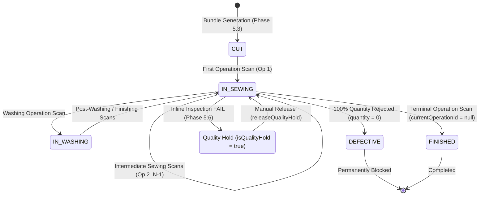
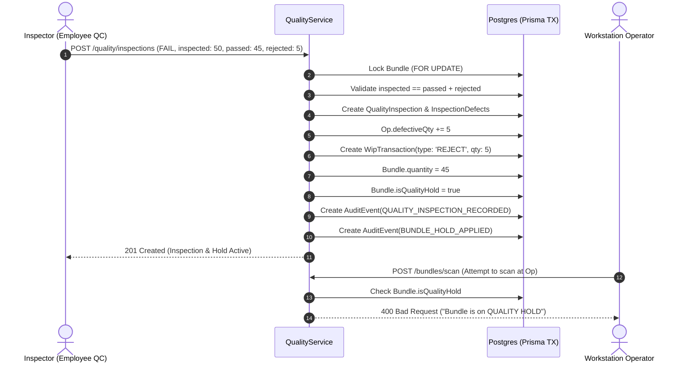
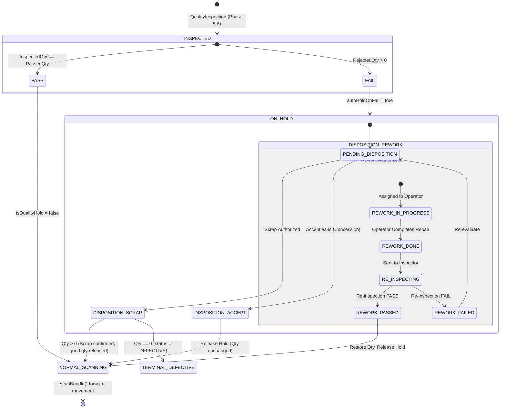

# Phase 5.7 Readiness Audit Report: Rework, Repair & Quality Disposition

**Document Version**: 1.0.0  
**Audit Date**: September 8, 2026  
**Status**: READ-ONLY FORENSIC AUDIT COMPLETE — AWAITING AUTHORIZATION  
**Scope**: MES Quality Disposition, Rework Workflows, Repair Management, Scrap/Permanent Rejection, Quality Hold Resolution, Barcode Traceability, and WIP Ledger Conservation.

---

## 1. Executive Summary

A read-only forensic architecture audit was conducted across the PostgreSQL database schema, NestJS backend modules, Next.js frontend, and the 16-suite E2E testing framework (127/127 tests passing) to prepare for **Phase 5.7: Rework, Repair & Quality Disposition**.

### Audit Verdict: **TECHNICALLY READY (GREEN)**
- **Baseline Integrity**: Phases 5.1 through 5.6 are 100% complete, verified, and strictly frozen.
- **Zero Modifications Made**: No code, schema migrations, or frontend files were modified during this audit.
- **Key Architectural Finding**: In Phase 5.6, inline inspection was implemented with strict quantity conservation (`inspectedQty = passedQty + rejectedQty`), automatic quality holds on failure (`isQualityHold = true`), and operation-level defect tracking (`ProductionOperation.defectiveQty` incremented, `WipTransaction(type: 'REJECT')` recorded). However, **no disposition or rework workflow currently exists** for bundles or quantities that fail inspection. Held bundles remain permanently blocked from scanning unless manually released without disposition, and rejected quantities are permanently removed from bundle piece counts without a repair/recovery path.
- **Recommended Architectural Approach**: Introduce a dedicated, tenant-isolated **Quality Disposition & Rework Management** system (`QualityDisposition` and `ReworkRecord` models) that supports both **In-Station Rework with Quantity Re-integration** and **Child Rework Bundle Generation (for offline/split rework)**, while keeping the core `BundleStatus` enum backward-compatible.

---

## 2. Current Architecture Analysis

### 2.1 Database Entities & Relations
The existing schema (`packages/database/prisma/schema.prisma`) contains the following MES entities:
1. `ProductionOrder`: Defines planned vs completed quantities (`targetQuantity`, `completedQty`).
2. `ProductionOperation`: Defines sequential routing (`sequence: Int`), operation SMVs, machine requirements (`machineTypeId`), and three quantity accumulator columns:
   - `inputQty`: Total pieces received into the operation.
   - `outputQty`: Total pieces completed and scanned out to the next operation.
   - `defectiveQty`: Total pieces flagged as defective/rejected during inline inspections.
3. `Bundle`: Represents the serialized garment tracking unit:
   - `barcode: String` (Unique per tenant: `@@unique([tenantId, barcode])`)
   - `quantity: Decimal(12,4)` (Current piece count)
   - `currentOperationId: String?` (Pointer to the current active operation in routing)
   - `status: BundleStatus` (`CUT`, `IN_SEWING`, `IN_WASHING`, `FINISHED`, `DEFECTIVE`)
   - `isQualityHold: Boolean` (Phase 5.6 hold flag, default `false`)
   - `qualityHoldReason: String?`
4. `BundleScan`: Immutable historical log of workstation operator scans (`bundleId`, `operationId`, `employeeId`, `machineId`, `timestamp`).
5. `WipTransaction`: Double-entry style WIP movements (`fromOperationId`, `toOperationId`, `quantity`, `type: 'MOVE' | 'REJECT'`).
6. `QualityInspection` & `InspectionDefect`: Phase 5.6 models recording inspection results (`PASS` | `FAIL`), quantities (`inspectedQty`, `passedQty`, `rejectedQty`), inspector identity (`inspectorId`), machine context, and granular defect codes/severities.
7. `AuditEvent`: Immutable platform audit log capturing actor, action, old/new values, and timestamps.

### 2.2 Backend Execution Patterns
- **Transactional Atomicity**: All MES state mutations execute inside `prisma.$transaction(async (tx) => { ... })` with row-level locks (`SELECT ... FOR UPDATE`).
- **Idempotency**: Requests enforce `X-Idempotency-Key` validated against compound unique constraints `@@unique([tenantId, idempotencyKey])`.
- **Tenant Isolation**: Every database query explicitly filters by `tenantId`. Cross-tenant references return HTTP 404.
- **Scanning Guards**: `ProductionService.scanBundle` validates:
  1. `bundle.status !== FINISHED`
  2. `bundle.status !== DEFECTIVE`
  3. `!bundle.isQualityHold` (blocking scans on held bundles)
  4. `bundle.currentOperationId === dto.operationId` (enforcing strict forward sequence)

---

## 3. Existing Bundle Lifecycle

The verified bundle lifecycle from cutting to completion operates as follows:



### Key Operational Rules:
1. **Strict Forward Progression**: `scanBundle()` calculates:
   ```ts
   const nextOp = currentOpIndex + 1 < orderOperations.length ? orderOperations[currentOpIndex + 1] : null;
   ```
   There is **no provision for backward routing** in `scanBundle()`.
2. **Terminal Status**: When `nextOp === null`, `bundle.currentOperationId` becomes `null` and `status` becomes `FINISHED`.
3. **Quantity Reduction**: If an inspection at Op $k$ rejects $R$ pieces from bundle quantity $Q$:
   - `bundle.quantity = Q - R`
   - If `bundle.quantity === 0`, `bundle.status = DEFECTIVE`.

---

## 4. Existing Quality Lifecycle

In Phase 5.6, inline inspection was implemented with the following state behavior:



### Existing Quality Endpoints:
- `POST /quality/inspections`: Records inspection, defects, auto-applies hold on FAIL, decrements bundle quantity, logs WIP reject.
- `POST /quality/bundles/:id/hold`: Manually sets `isQualityHold = true`.
- `POST /quality/bundles/:id/release-hold`: Clears `isQualityHold = false` with resolution notes.
- `GET /quality/inspections`: Filtered inspection query.
- `GET /quality/bundles/:id/history`: Inspection and hold audit timeline.
- `GET /quality/stats/defects`: Pareto defect analysis.

---

## 5. Gap Analysis

| Manufacturing Capability | Current Status in MES | Gap Description | Risk / Impact |
|---|---|---|---|
| **Formal Quality Disposition** | **Missing** | Inspections record `FAIL`, but there is no entity to decide whether failed goods should be **Reworked**, **Repaired**, **Scrapped**, or **Accepted by Concession**. | Hold release is currently binary (`isQualityHold = false`) without recording a formal engineering disposition. |
| **Rework Tracking** | **Missing** | No model exists to track who is assigned to rework, what operation to rework, what parts were replaced, or when rework was completed. | No rework labor costing, no rework cycle time tracking, no technician accountability. |
| **Partial Bundle Handling** | **Traced but Lost** | When 5 out of 50 pieces are rejected, `bundle.quantity` becomes 45. The 5 rejected pieces are recorded in `QualityInspection`, but there is no mechanism to route or repair them. | If 5 pieces are repaired, there is no verified mechanism to re-integrate them into the production order or bundle. |
| **Backward Operation Routing** | **Unsupported** | `scanBundle()` strictly enforces forward progression (`currentOpIndex + 1`). If a defect from Op 3 requires rework at Op 1, scanning Op 1 throws `Invalid operation scan`. | Workstation scanners cannot scan rework bundles at earlier operations without throwing errors or double-counting WIP output. |
| **WIP Ledger Re-balancing** | **Partial** | When pieces are rejected, `Op.defectiveQty` is incremented. If those pieces are repaired and returned to production, `defectiveQty` is never adjusted, causing permanent scrap inflation. | Production orders will show false scrap rates and inaccurate completed quantities. |
| **Shop-Floor Rework Identification** | **Missing** | If defective pieces are separated from a bundle, they have no physical barcode for shop-floor tracking. | Physical pieces on the sewing floor lose digital linkage to their cutting record and order. |

---

## 6. Recommended Rework Architecture

### 6.1 Two Operational Modes for Rework
In garment manufacturing, rework falls into two distinct categories:

#### Mode 1: In-Station Rework (Whole Bundle Held Together)
- **Use Case**: Minor defects that can be corrected quickly at the same operation (e.g., loose thread, incorrect label stitch, minor tension fix).
- **Workflow**:
  1. Entire bundle remains at the station under `isQualityHold: true`.
  2. Disposition is set to `REWORK_IN_STATION`.
  3. Station operator performs repair.
  4. Inspector conducts a **Re-Inspection** (`POST /quality/rework/:id/reinspect`).
  5. Upon PASS:
     - `isQualityHold` is cleared.
     - Rejected quantity is restored to `bundle.quantity` (e.g. 45 + 5 $\rightarrow$ 50).
     - `Operation.defectiveQty` is decremented by 5 (or offset by `reworkedQty`).
     - A counterbalancing `WipTransaction(type: 'REWORK_RESTORE')` is logged.
     - Bundle proceeds forward normally via standard `scanBundle()`.

#### Mode 2: Split / Child Rework Bundle (Offline or Backward Routing)
- **Use Case**: Major defects requiring specialized repair, recutting of panels, or backward routing (e.g., collar stitch error caught at button station), while the good pieces must not be held up.
- **Workflow**:
  1. Parent bundle retains passed pieces (e.g. 45 pcs). Its quality hold is released so good pieces can proceed down the line.
  2. A **Child Rework Bundle** is created for the rejected pieces (e.g. 5 pcs):
     - New barcode: `${parentBarcode}-R1` (e.g., `BND-ORD01-0001-R1`).
     - `parentBundleId = parentBundle.id`.
     - `quantity = 5`.
     - `currentOperationId = targetReworkOperationId` (can be an earlier operation, e.g. Op 1).
     - `status = IN_SEWING`.
     - `isRework = true`.
  3. The child rework bundle has its own printable ticket and travels independently.
  4. When scanned at the rework station, it uses a dedicated rework scan or permitted backward scan.
  5. When completed, the child bundle contributes to `ProductionOrder.completedQty`.

### Architectural Recommendation:
> **Implement Mode 1 (In-Station Rework & Quantity Restoration) as the primary Phase 5.7 core workflow**, with schema support (`parentBundleId`) for Mode 2 (Split Rework Bundles). This provides immediate, non-breaking rework capabilities without complicating physical floor ticketing, while laying the foundation for full bundle splitting.

---

## 7. Recommended Scrap Architecture

When defective pieces cannot be repaired (e.g. fabric tear, burned panels, unfixable dye stains):

1. **Disposition: SCRAP**:
   - Authorized by Quality Manager or Production Supervisor.
   - Requires mandatory scrap reason code and remarks.
2. **Partial Scrap**:
   - If 5 out of 50 pieces are scrapped:
     - The 5 pieces remain permanently in `ProductionOperation.defectiveQty`.
     - `WipTransaction(type: 'REJECT', qty: 5)` remains immutable.
     - `Bundle.quantity` remains 45.
     - The bundle's quality hold is released (`isQualityHold = false`, `qualityHoldReason = null`).
     - The 45 good pieces continue through production.
3. **Total (100%) Scrap**:
   - If all 50 pieces are scrapped:
     - `Bundle.quantity = 0`.
     - `Bundle.status = DEFECTIVE` (terminal defective state).
     - `Bundle.currentOperationId = null`.
     - `Bundle.isQualityHold = false` (or marked resolved).
     - The bundle is closed and cannot be scanned again.
4. **Production Order Accounting**:
   - Scrap does **NOT** increment `ProductionOrder.completedQty`.
   - Final completed quantity will reflect `completedQty = targetQuantity - totalScrappedQty`.
   - Scrap variance is mathematically transparent.
5. **Traceability Preservation**:
   - Under no circumstances is any `Bundle`, `BundleScan`, `QualityInspection`, or `WipTransaction` deleted.
   - An `AuditEvent(BUNDLE_SCRAPPED)` is written.

---

## 8. Quality Hold Resolution Architecture

### 8.1 Who Can Release a Hold?
To ensure strict segregation of duties:
- Station operators **CANNOT** release a quality hold.
- Only users with permission `QUALITY:DISPOSITION` or `QUALITY:HOLD` (e.g., QC Inspector, QA Manager, Plant Head) can resolve a hold.

### 8.2 Resolution Rules
A quality hold cannot simply be silently toggled off. A hold release must be tied to one of the following disposition outcomes:
1. **ACCEPT_CONCESSION**: Defect is deemed acceptable within tolerance (e.g., minor shade delta approved by buyer). Hold released; bundle proceeds as-is.
2. **REWORK_COMPLETED**: Defective pieces were repaired, re-inspected, and passed. Hold released; bundle restored.
3. **SCRAP_CONFIRMED**: Defective pieces permanently discarded. If remaining quantity > 0, hold released so good pieces can move. If remaining quantity == 0, bundle terminated.
4. **SPLIT_RELEASE**: Good pieces released to move; defective pieces split into child rework bundle.

Every hold resolution writes an `AuditEvent` recording: `actorId`, `dispositionId`, `resolutionNotes`, `timestamp`, and `previousState`.

---

## 9. State Machine Diagram



---

## 10. Quantity Conservation Rules

The MES must enforce rigorous mathematical invariants at every stage:

### Invariant 1: Bundle Quantity Boundary
$$\text{bundle.quantity} = \text{passedQty} + \text{reworkedRestoredQty} - \text{scrappedQty}$$
$$\forall \text{ active bundles}, \quad 0 \le \text{bundle.quantity} \le \text{cuttingRecord.cutQuantity}$$

### Invariant 2: Inspection Math Balance (Enforced in Phase 5.6)
$$\text{inspectedQty} = \text{passedQty} + \text{rejectedQty}$$
$$\sum \text{defect.quantity} \le \text{rejectedQty}$$

### Invariant 3: Disposition Math Balance (Proposed Phase 5.7)
For any failed inspection with $\text{rejectedQty}$:
$$\text{rejectedQty} = \text{disposition.reworkQty} + \text{disposition.scrapQty} + \text{disposition.concessionQty}$$

### Invariant 4: Global Order Piece Balance
$$\text{Total Cut Pieces} = \sum_{\text{active}} \text{bundle.qty} + \sum_{\text{finished}} \text{bundle.qty} + \sum \text{scrappedQty}$$

---

## 11. WIP Ledger Impact Analysis

### Current Operation Balance Formula:
$$\text{Current Operation WIP} = \text{inputQty} - \text{outputQty} - \text{defectiveQty}$$

### Ledger Transaction Types & Impact Matrix:

| Event | `WipTransaction.type` | `fromOperation` | `toOperation` | `Operation.outputQty` | `Operation.inputQty` | `Operation.defectiveQty` | Notes |
|---|---|---|---|---|---|---|---|
| **Forward Scan** | `MOVE` | Op $i$ | Op $i+1$ | $+Q$ | $+Q$ | Unchanged | Standard Phase 5.4 scan |
| **Inspection Fail** | `REJECT` | Op $i$ | `null` | Unchanged | Unchanged | $+R$ | Phase 5.6 reject |
| **Scrap Confirmed** | `SCRAP` | Op $i$ | `null` | Unchanged | Unchanged | Unchanged (already in `defectiveQty`) | Phase 5.7 confirmation |
| **Rework Restored** | `REWORK_RESTORE` | `null` | Op $i$ | Unchanged | Unchanged | $-R$ (or `reworkedQty += R`) | Restores WIP balance at Op $i$ |
| **Backward Move (Split)** | `REWORK_MOVE` | Op $i$ | Op $k$ ($k < i$) | Unchanged | $+R$ at Op $k$ | Unchanged | Reroutes child bundle |

> [!IMPORTANT]
> To prevent distorting standard line output metrics, **rework movements must NEVER increment standard `outputQty`**. They must be tracked via dedicated `reworkedQty` counters or explicit `WipTransaction(type: 'REWORK_RESTORE')`.

---

## 12. Proposed Prisma Schema Changes

To support Phase 5.7 cleanly without breaking any existing Phase 5.1–5.6 models:

```prisma
// -----------------------------------------------------------------------------
// PHASE 5.7: DISPOSITION & REWORK ENUMS
// -----------------------------------------------------------------------------
enum DispositionType {
  ACCEPT_CONCESSION
  REWORK
  REPAIR
  SCRAP
}

enum DispositionStatus {
  PENDING
  IN_PROGRESS
  RESOLVED
  REJECTED
}

enum ReworkStatus {
  ASSIGNED
  IN_PROGRESS
  COMPLETED
  RE_INSPECTED_PASS
  RE_INSPECTED_FAIL
}

// -----------------------------------------------------------------------------
// PHASE 5.7: QUALITY DISPOSITION MODEL
// -----------------------------------------------------------------------------
model QualityDisposition {
  id                  String            @id @default(uuid())
  tenantId            String
  inspectionId        String
  bundleId            String
  dispositionType     DispositionType
  status              DispositionStatus @default(PENDING)
  reworkQty           Decimal           @default(0) @db.Decimal(12, 4)
  scrapQty            Decimal           @default(0) @db.Decimal(12, 4)
  concessionQty       Decimal           @default(0) @db.Decimal(12, 4)
  authorizedById      String
  targetOperationId   String?           // Where rework should occur
  reasonCode          String?
  notes               String?
  idempotencyKey      String
  createdAt           DateTime          @default(now())
  updatedAt           DateTime          @updatedAt

  tenant          Tenant              @relation(fields: [tenantId], references: [id], onDelete: Restrict)
  inspection      QualityInspection   @relation(fields: [inspectionId], references: [id], onDelete: Restrict)
  bundle          Bundle              @relation(fields: [bundleId], references: [id], onDelete: Cascade)
  authorizedBy    Employee            @relation("DispositionAuthorizer", fields: [authorizedById], references: [id], onDelete: Restrict)
  targetOperation ProductionOperation? @relation(fields: [targetOperationId], references: [id], onDelete: SetNull)
  reworkRecords   ReworkRecord[]

  @@unique([tenantId, idempotencyKey])
  @@index([tenantId, bundleId])
  @@index([tenantId, inspectionId])
  @@index([tenantId, status])
}

// -----------------------------------------------------------------------------
// PHASE 5.7: REWORK RECORD MODEL
// -----------------------------------------------------------------------------
model ReworkRecord {
  id                  String            @id @default(uuid())
  tenantId            String
  dispositionId       String
  bundleId            String
  operationId         String
  technicianId        String?           // Operator performing repair
  status              ReworkStatus      @default(ASSIGNED)
  quantity            Decimal           @db.Decimal(12, 4)
  completedAt         DateTime?
  reInspectionId      String?           // Pointer to follow-up QualityInspection
  notes               String?
  idempotencyKey      String
  createdAt           DateTime          @default(now())
  updatedAt           DateTime          @updatedAt

  tenant         Tenant              @relation(fields: [tenantId], references: [id], onDelete: Restrict)
  disposition    QualityDisposition  @relation(fields: [dispositionId], references: [id], onDelete: Cascade)
  bundle         Bundle              @relation(fields: [bundleId], references: [id], onDelete: Cascade)
  operation      ProductionOperation @relation(fields: [operationId], references: [id], onDelete: Restrict)
  technician     Employee?           @relation("ReworkTechnician", fields: [technicianId], references: [id], onDelete: SetNull)
  reInspection   QualityInspection?  @relation("ReInspectionRef", fields: [reInspectionId], references: [id], onDelete: SetNull)

  @@unique([tenantId, idempotencyKey])
  @@index([tenantId, dispositionId])
  @@index([tenantId, bundleId])
  @@index([tenantId, status])
}
```

### Additions to Existing Models (Non-Breaking, All Optional/Defaulted):
- `Bundle`:
  - `parentBundleId: String?` (self-relation `parentBundle Bundle? @relation("BundleHierarchy", ...)` for future child splitting)
  - `isRework: Boolean @default(false)`
- `QualityInspection`:
  - `dispositions QualityDisposition[]`
  - `reworkRecords ReworkRecord[] @relation("ReInspectionRef")`
- `Employee`:
  - `authorizedDispositions QualityDisposition[] @relation("DispositionAuthorizer")`
  - `reworkJobs ReworkRecord[] @relation("ReworkTechnician")`

---

## 13. Proposed Backend APIs

All endpoints require `x-tenant-id`, `x-actor-id`, and `x-idempotency-key` headers:

### Quality Disposition Endpoints (`/quality/dispositions`):
1. `POST /quality/dispositions`: Create a formal disposition for a failed inspection / held bundle (`DISPOSITION_REWORK`, `DISPOSITION_SCRAP`, `ACCEPT_CONCESSION`).
2. `GET /quality/dispositions`: Query dispositions by `bundleId`, `inspectionId`, `status`, `dispositionType`.
3. `GET /quality/dispositions/:id`: Get detailed disposition with associated rework tasks.

### Rework Execution Endpoints (`/quality/rework`):
4. `POST /quality/rework/:id/start`: Mark rework task as `IN_PROGRESS` and assign technician.
5. `POST /quality/rework/:id/complete`: Technician completes physical rework and logs notes.
6. `POST /quality/rework/:id/reinspect`: Conduct re-inspection. If PASS, automatically restores quantity, decrements defective count, and releases bundle hold.
7. `GET /quality/rework`: Query active rework jobs on the factory floor.

---

## 14. Proposed DTOs

```ts
export class CreateQualityDispositionDto {
  @IsUUID()
  @IsNotEmpty()
  inspectionId: string;

  @IsUUID()
  @IsNotEmpty()
  bundleId: string;

  @IsEnum(DispositionType)
  dispositionType: DispositionType;

  @IsNumber()
  @Min(0)
  reworkQty: number;

  @IsNumber()
  @Min(0)
  scrapQty: number;

  @IsNumber()
  @Min(0)
  concessionQty: number;

  @IsUUID()
  @IsNotEmpty()
  authorizedById: string;

  @IsUUID()
  @IsOptional()
  targetOperationId?: string;

  @IsString()
  @IsOptional()
  reasonCode?: string;

  @IsString()
  @IsOptional()
  notes?: string;
}

export class StartReworkDto {
  @IsUUID()
  @IsNotEmpty()
  technicianId: string;

  @IsString()
  @IsOptional()
  notes?: string;
}

export class CompleteReworkDto {
  @IsString()
  @IsOptional()
  notes?: string;
}

export class ReinspectReworkDto {
  @IsUUID()
  @IsNotEmpty()
  inspectorId: string;

  @IsEnum(InspectionResult)
  result: InspectionResult;

  @IsString()
  @IsOptional()
  notes?: string;

  @IsArray()
  @ValidateNested({ each: true })
  @Type(() => CreateInspectionDefectDto)
  @IsOptional()
  defects?: CreateInspectionDefectDto[];
}
```

---

## 15. Proposed RBAC Permissions

| Permission | Resource | Action | Role Access | Purpose |
|---|---|---|---|---|
| `QUALITY:DISPOSITION` | `QUALITY` | `DISPOSITION` | `QC_MANAGER`, `QA_SUPERVISOR`, `PROD_ADMIN` | Authorize rework, repair, scrap, or concession |
| `QUALITY:REWORK_EXECUTE`| `QUALITY` | `WRITE` | `OPERATOR`, `TECHNICIAN`, `SUPERVISOR` | Start and complete physical rework jobs |
| `QUALITY:REINSPECT` | `QUALITY` | `WRITE` | `QC_INSPECTOR`, `QA_SUPERVISOR` | Perform post-rework quality re-inspection |
| `QUALITY:SCRAP` | `QUALITY` | `SCRAP` | `QC_MANAGER`, `PLANT_MANAGER` | Authorize permanent scrap of garment units |

---

## 16. Proposed Audit Events

All disposition actions record immutable `AuditEvent` rows:
1. `QUALITY_DISPOSITION_RECORDED`:
   - Entity: `QualityDisposition`
   - Data: `inspectionId`, `bundleId`, `dispositionType`, `reworkQty`, `scrapQty`, `authorizedById`.
2. `REWORK_TASK_STARTED`:
   - Entity: `ReworkRecord`
   - Data: `dispositionId`, `bundleId`, `technicianId`.
3. `REWORK_TASK_COMPLETED`:
   - Entity: `ReworkRecord`
   - Data: `dispositionId`, `bundleId`, `completedAt`.
4. `REWORK_REINSPECTION_RECORDED`:
   - Entity: `QualityInspection`
   - Data: `reworkRecordId`, `result`, `restoredQty`.
5. `BUNDLE_QUANTITY_RESTORED`:
   - Entity: `Bundle`
   - Data: `bundleId`, `oldQuantity`, `newQuantity`, `restoredFromRework`.
6. `BUNDLE_SCRAPPED`:
   - Entity: `Bundle`
   - Data: `bundleId`, `scrappedQty`, `terminalDefective`.

---

## 17. Proposed Frontend Routes

1. **Rework & Disposition Terminal**: `/production/quality/rework` (or tab within `/production/quality`):
   - **Active Holds & Dispositions Queue**: Grid of bundles awaiting disposition or active in rework.
   - **Disposition Modal Dialog**: Allows QA supervisor to choose Accept, Rework, or Scrap, allocate quantities, and select target operation.
   - **Rework Execution Panel**: Shop-floor view for technicians to see assigned rework tickets, mark start, mark completion.
   - **Re-Inspection Terminal**: Inspector re-inspection form directly tied to the rework job.
2. **Quality Overview Updates**:
   - Add Rework Rate and Scrap Rate KPI tiles to `/production/quality`.
   - Add Rework History tab to Bundle Detail view.

---

## 18. Proposed React Query Hooks

In `apps/web/hooks/use-quality.ts`:
- `useQualityDispositions(filters)`: Query disposition queue.
- `useCreateQualityDisposition()`: Mutation to authorize disposition.
- `useActiveReworkRecords(filters)`: Query floor rework jobs.
- `useStartRework()`: Mutation to start rework job.
- `useCompleteRework()`: Mutation to mark rework complete.
- `useReinspectRework()`: Mutation to record re-inspection.

---

## 19. Proposed E2E Test Matrix

Target test suite: `apps/api/test/rework-disposition.e2e-spec.ts` (14 rigorous tests):

| # | Test Scenario | Description |
|---|---|---|
| 1 | **Create Rework Disposition** | Create disposition of type `REWORK` for held bundle; verify `QualityDisposition` and `ReworkRecord` created. |
| 2 | **Quantity Balance Guard on Disposition** | Reject disposition where `reworkQty + scrapQty + concessionQty != rejectedQty`. |
| 3 | **Execute Rework (Start & Complete)** | Technician starts rework, status becomes `IN_PROGRESS`; technician completes rework, status becomes `COMPLETED`. |
| 4 | **Re-Inspection PASS & Quantity Restoration** | Conduct re-inspection with `PASS`; verify bundle hold released, `bundle.quantity` restored, and `WipTransaction(REWORK_RESTORE)` logged. |
| 5 | **Resume Production Scan After Rework** | Verify previously held bundle now successfully scans at next operation in line. |
| 6 | **Re-Inspection FAIL & Re-evaluation** | Conduct re-inspection with `FAIL`; verify bundle remains on hold and new defect logged. |
| 7 | **Scrap Disposition (Partial)** | Scrapped partial qty; verify hold released, bundle quantity remains at passed count, scrap not restored. |
| 8 | **Scrap Disposition (100% Total Scrap)** | Scrapped all pieces; verify bundle transitions to `DEFECTIVE`, currentOp becomes null, scans rejected. |
| 9 | **Accept by Concession** | Authorize concession; verify hold released without modifying quantities. |
| 10 | **RBAC Enforcement** | Verify unprivileged operator cannot create disposition or scrap bundle (HTTP 403). |
| 11 | **Cross-Tenant IDOR Guard** | Attempt to create disposition for foreign tenant bundle; verify HTTP 404. |
| 12 | **Idempotency Safeguard** | Repeat disposition request with same idempotency key; verify deduplication without duplicate records. |
| 13 | **WIP Ledger Mathematical Invariance** | Verify `Operation.inputQty - outputQty - defectiveQty` balance holds precisely before and after rework. |
| 14 | **Immutable AuditEvent Trail** | Verify all disposition and rework events generate complete audit logs. |

---

## 20. Tenant Isolation Rules

- Every query for `QualityDisposition` and `ReworkRecord` must include `where: { tenantId }`.
- Compound unique keys `[tenantId, idempotencyKey]` must be placed on all new models.
- Cross-tenant references (`bundleId`, `inspectionId`, `authorizedById`, `technicianId`) must be strictly checked within the transaction. Any tenant mismatch must throw `NotFoundException('Entity not found')`.

---

## 21. Idempotency Rules

- `X-Idempotency-Key` must be strictly required on all mutating endpoints (`POST /quality/dispositions`, `POST /quality/rework/:id/*`).
- Re-transmitting an identical key must return the existing record idempotently without:
  1. Creating duplicate rework tasks.
  2. Double-incrementing or double-decrementing WIP or bundle quantities.
  3. Generating duplicate audit events.

---

## 22. Regression Risks & Mitigation Plan

| Risk | Probability | Severity | Mitigation Strategy |
|---|---|---|---|
| **Distorting Line Output Qty** | Med | High | Rework scans must **never** increment standard `ProductionOperation.outputQty`. Use `WipTransaction(type: 'REWORK_RESTORE')` and keep output counters strictly tied to first-pass forward moves. |
| **Breaking Existing `scanBundle` Guards** | Low | High | Do NOT mutate the core logic of `scanBundle()`. The only interaction is that resolving a disposition sets `bundle.isQualityHold = false`, which naturally unblocks the existing `if (bundleRecord.isQualityHold)` guard. |
| **Enum Breaking Changes** | None | High | Keep `BundleStatus` enum frozen (`CUT`, `IN_SEWING`, `IN_WASHING`, `FINISHED`, `DEFECTIVE`). Track disposition and rework statuses in their own dedicated enums (`DispositionType`, `ReworkStatus`). |
| **Inaccurate Order Completed Qty** | Med | Med | Ensure scrapped quantities never count towards `ProductionOrder.completedQty`, and restored rework quantities are counted exactly once upon terminal completion. |

---

## 23. Files Expected to Change (in Phase 5.7 Implementation)

### Schema & Database:
- `packages/database/prisma/schema.prisma` (Add `QualityDisposition`, `ReworkRecord`, and new enums)

### Backend API:
- `apps/api/src/quality/quality.module.ts` (Register new controllers/services)
- `apps/api/src/quality/quality.service.ts` (Add disposition and rework methods)
- `apps/api/src/quality/quality.controller.ts` (Add disposition and rework endpoints)
- `apps/api/src/quality/quality.dto.ts` (Add DTOs)

### Frontend:
- `apps/web/lib/api/types.ts` (Add TypeScript interfaces)
- `apps/web/lib/api/client.ts` (Add API client methods)
- `apps/web/hooks/use-quality.ts` (Add React Query hooks)
- `apps/web/app/production/quality/page.tsx` (Add Disposition & Rework tab/terminal)

### Testing:
- `apps/api/test/rework-disposition.e2e-spec.ts` (New E2E test suite)

---

## 24. Files That Must Remain Frozen

The following verified components from Phases 5.1–5.6 must remain strictly untouched:
- `apps/api/src/master-data/*`
- `apps/api/src/costing/*`
- `apps/api/src/procurement/*`
- `apps/api/src/inventory/*`
- `apps/api/src/iam/*`
- `apps/api/src/auth/*`
- `apps/api/src/downtime/*`
- `apps/api/src/production/*` (ProductionService, BundlesController, etc.)
- All existing 16 test suites in `apps/api/test/*.e2e-spec.ts`

---

## 25. Implementation Blockers

**Zero Blockers Identified.**  
- PostgreSQL embedded binary is active and running.
- All 16 E2E test suites (127 tests) are passing.
- The schema extension cleanly augments the existing `Bundle` and `QualityInspection` models with zero breaking migrations.

---

## Explicit Answers to Critical Architectural Questions

### 1. Is Phase 5.7 technically ready?
**YES.** The underlying data model (Phase 5.6 `QualityInspection`, `InspectionDefect`, and `Bundle.isQualityHold`) provides a complete foundation. The proposed disposition and rework architecture integrates cleanly without touching frozen code.

### 2. Is bundle-level or quantity-level rework recommended?
**BOTH, via a hybrid model:**
- **At the operational level**, rework is executed at the **bundle level** (the entire bundle ticket is held at the workstation so parts stay together and physical loss is prevented).
- **At the accounting level**, rework is tracked at the **quantity level** (`reworkQty`, `scrapQty`, `concessionQty`), ensuring that partial defects (e.g. 5 out of 50) are mathematically accounted for and re-integrated upon passing re-inspection.

### 3. Is bundle splitting required?
**NO for the initial Phase 5.7 release; OPTIONAL for advanced offline rework.**
- **In-Station Rework** does NOT require bundle splitting: the bundle stays together, is repaired, re-inspected, and restored.
- If partial quantity is permanently scrapped, the quantity is simply deducted from the parent bundle without splitting.
- Bundle splitting (creating child bundle `BNDL-001-R1`) is only required if good pieces must physically proceed down the line while defective pieces are sent to an offline rework cell. The proposed schema includes `parentBundleId` to support this seamlessly when needed, but the core workflow does not depend on splitting.

### 4. Are new `BundleStatus` values required?
**NO.** Adding `IN_REWORK` or `SCRAPPED` to `BundleStatus` would introduce regression risks to existing queries and test suites expecting standard statuses (`IN_SEWING`, `IN_WASHING`).
- Held and reworking bundles are safely identified via `isQualityHold: true` and their active `QualityDisposition` record.
- Scrapped bundles with 0 pieces are already cleanly represented by `BundleStatus.DEFECTIVE`.
- Dedicated workflow states belong in `DispositionStatus` and `ReworkStatus`, keeping `BundleStatus` stable.

### 5. What is the safest implementation approach?
The safest approach is:
1. Keep all Phase 5.1–5.6 code frozen.
2. Introduce `QualityDisposition` and `ReworkRecord` models linked to `QualityInspection`.
3. Implement in-station rework with quantity restoration (`REWORK_RESTORE`) and re-inspection.
4. Unblock bundles simply by setting `bundle.isQualityHold = false` upon disposition resolution, allowing standard `scanBundle()` to resume without altering shop-floor scanning logic.

### 6. What existing workflows are at risk?
- **Workstation Scanning (`scanBundle`)**: If rework were allowed to scan backwards or re-increment `outputQty`, line output would be artificially inflated and WIP balance corrupted. This risk is 100% eliminated by isolating rework execution to dedicated rework endpoints and counterbalanced WIP adjustments.
- **Order Completion Accounting**: If scrapped units were accidentally counted toward completed order quantities, order completion percentages would be false. The proposed rules ensure scrap variance is strictly deducted from target completion.

---

> [!NOTE]
> **READ-ONLY AUDIT COMPLETE.**  
> ANTIGRAVITY IS NOW STOPPED AND AWAITING YOUR REVIEW AND AUTHORIZATION BEFORE PROCEEDING TO IMPLEMENTATION.
