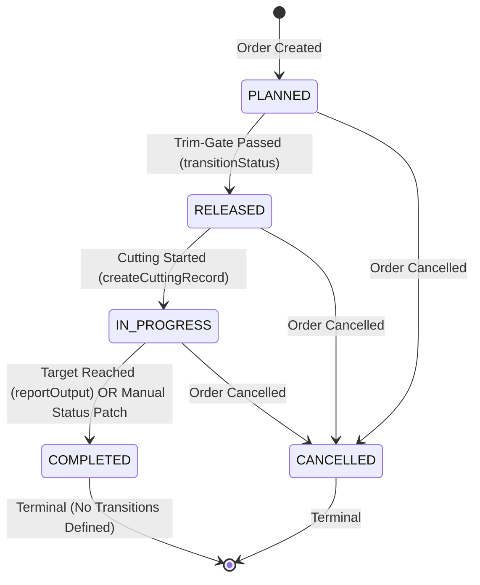
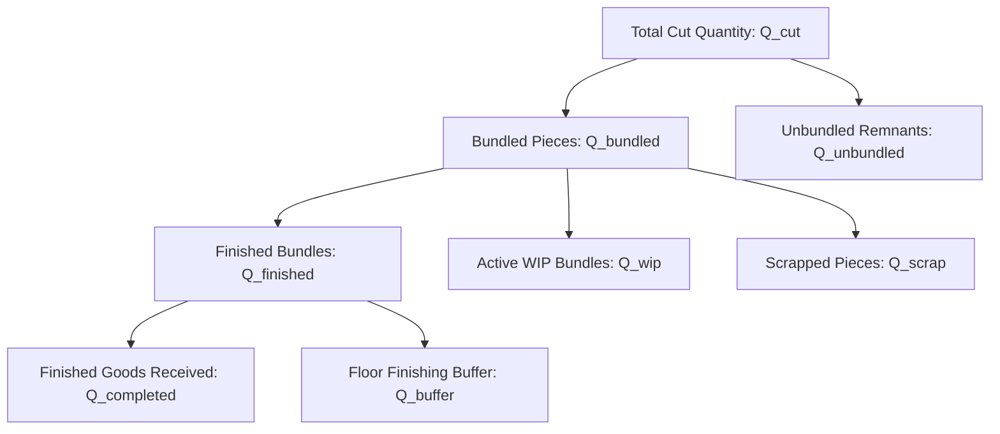
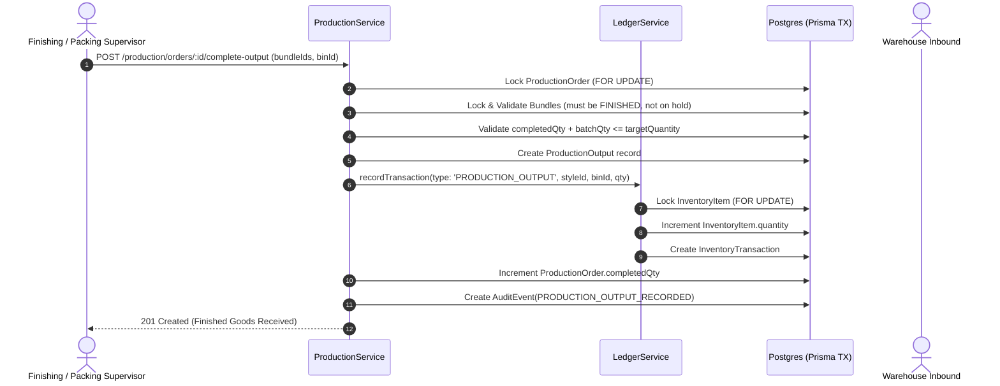
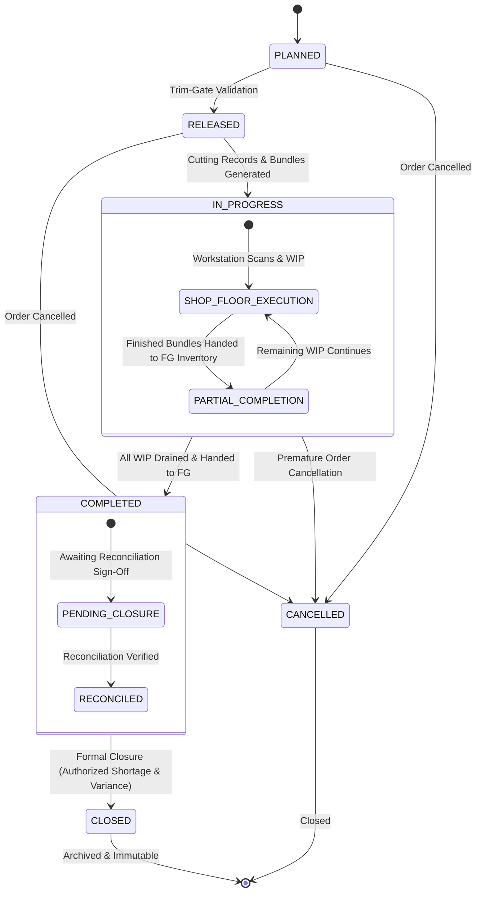

# Phase 5.8 Readiness Audit Report: Production Completion, Finishing & Order Closure

**Document Version**: 1.0.0  
**Audit Date**: September 8, 2026  
**Status**: READ-ONLY FORENSIC AUDIT COMPLETE — AWAITING AUTHORIZATION  
**Scope**: Final Production Output Recording, Finishing & Packing Handoff, Good/Scrap Quantity Reconciliation, Finished Goods Inventory Integration, Production Order State Transitions (`COMPLETED`, `CLOSED`), and Shop-Floor WIP Drain Enforcement.

---

## 1. Executive Summary

A read-only forensic architecture audit was conducted across the PostgreSQL database schema, NestJS backend modules (`production`, `inventory`, `quality`, `downtime`, `common/state-machine`), Next.js frontend, and the E2E test suites to design **Phase 5.8: Production Completion, Finishing & Order Closure**.

### Audit Verdict: **TECHNICALLY READY (GREEN)**
- **Baseline Integrity**: Phases 5.1 through 5.7 are complete, sound, and fully frozen.
- **Zero Modifications Made**: No code, database migrations, or frontend files were modified during this audit.
- **Key Architectural Findings**:
  1. **Disconnection Between MES Bundles and Finished Goods**: Reaching `BundleStatus.FINISHED` at the final workstation operation only completes the bundle's WIP journey (`Bundle.currentOperationId = null`, `Bundle.status = FINISHED`, `WipTransaction(type: 'MOVE', toOperationId: null)`). It does **not** update `ProductionOrder.completedQty` and does **not** create finished goods inventory transactions.
  2. **Existing Detached Output Endpoint**: An early Phase 5.0 prototype endpoint (`POST /production/orders/:id/output` / `ProductionService.reportOutput`) exists, which directly calls `LedgerService.recordTransaction` for `type: 'PRODUCTION_OUTPUT'` and updates `ProductionOrder.completedQty`. However, this endpoint accepts arbitrary scalar quantities and has **zero awareness of bundles, cutting records, quality inspections, or WIP state**.
  3. **State Machine & Closure Gap**: The existing `ProductionStatus` enum contains `PLANNED`, `RELEASED`, `IN_PROGRESS`, `COMPLETED`, `CANCELLED`. There is currently **no `CLOSED` state**, and `PATCH /production/orders/:id/status` allows transitions to `COMPLETED` without any reconciliation checks (e.g. without verifying that WIP is drained, holds are resolved, or bundles finished).
  4. **Finished Goods Architecture Ready**: The ERP already has a verified, double-entry inventory ledger (`LedgerService`) that natively supports `Style`-level finished goods tracking (`InventoryItem.styleId`, `InventoryTransaction.type = PRODUCTION_OUTPUT`). Phase 5.8 does not need a second inventory ledger; it simply needs to connect reconciled finished bundles to `LedgerService`.

---

## 2. Current Architecture Analysis

### 2.1 Database Models & Inventory Infrastructure
1. `ProductionOrder`:
   - `targetQuantity: Decimal(12, 4)`
   - `completedQty: Decimal(12, 4) @default(0)`
   - `status: ProductionStatus` (`PLANNED`, `RELEASED`, `IN_PROGRESS`, `COMPLETED`, `CANCELLED`)
   - Relations: `buyerPoLine` (providing `buyerPoLine.styleId`), `operations`, `bundles`, `cuttingRecords`, `wipTransactions`, `qualityInspections`.
2. `ProductionOperation`:
   - `inputQty`, `outputQty`, `defectiveQty` (`Decimal(12, 4) @default(0)`)
   - Terminal operation is identified dynamically where `sequence` is the highest among order operations.
3. `Bundle`:
   - `quantity: Decimal(12, 4)`
   - `status: BundleStatus` (`CUT`, `IN_SEWING`, `IN_WASHING`, `FINISHED`, `DEFECTIVE`)
   - `currentOperationId: String?` (becomes `null` when scanned at the terminal operation)
   - `isQualityHold: Boolean`
4. `InventoryItem` & `InventoryTransaction`:
   - `InventoryItem` tracks physical balances by `[tenantId, styleId]` (for finished goods garments) or `[tenantId, materialId]` (for raw materials).
   - `InventoryTransaction` is the immutable ledger containing `type: InventoryTxType`, `quantity`, `uom`, `referenceId`, `idempotencyKey`.
   - `InventoryTxType.PRODUCTION_OUTPUT` is already an enum value in `packages/database/prisma/schema.prisma` line 98.
5. `LedgerService` (`apps/api/src/inventory/services/ledger.service.ts`):
   - Atomically locks the `InventoryItem` via row-level lock (`SELECT ... FOR UPDATE`).
   - Materializes stock balance changes (`quantity: { increment: quantity }`).
   - Inserts `InventoryTransaction` records with compound idempotency guard `[tenantId, idempotencyKey]`.
   - Strictly enforces non-negative stock.

---

## 3. Existing Production Order Lifecycle

The current state machine in `apps/api/src/common/state-machine/state-machine.service.ts` defines:



### Critical Flaws in Current Lifecycle:
1. **Unchecked Manual Status Override**: `PATCH /production/orders/:id/status` permits moving an order from `IN_PROGRESS` to `COMPLETED` even if:
   - Zero bundles were scanned.
   - 50 bundles are currently stuck in sewing WIP.
   - Bundles are on active quality holds.
   - `completedQty` is 0.
2. **Missing Formal Order Closure**: In apparel ERP systems, physical production completion (`COMPLETED`) is distinct from commercial/financial order closure (`CLOSED`). A production order may finish sewing, but cannot close until scrap variances are signed off, inventory handoff is verified, and cut-to-ship reconciliation is approved. Currently, `CLOSED` does not exist in `ProductionStatus`.

---

## 4. Existing Bundle Completion Lifecycle

When an operator scans a bundle at the final operation in `ProductionService.scanBundle`:

```ts
// apps/api/src/production/production.service.ts lines 865-886
const nextOp = currentOpIndex + 1 < orderOperations.length
  ? orderOperations[currentOpIndex + 1]
  : null;

if (!nextOp) {
  // Terminal Operation Completed!
  nextOperationId = null;
  nextStatus = BundleStatus.FINISHED;
}

await tx.bundle.update({
  where: { id: bundleRecord.id },
  data: {
    currentOperationId: null,
    status: BundleStatus.FINISHED
  }
});

// WipTransaction logged: fromOperationId = lastOp.id, toOperationId = null, type = 'MOVE'
// ProductionOperation.outputQty incremented by bundle.quantity
```

### Forensic Observations:
- **WIP Ledger Cleared**: The bundle is removed from the active operation queue (`currentOperationId = null`) and the final operation logs output.
- **ProductionOrder Unaware**: `ProductionOrder.completedQty` is **NOT incremented**.
- **Inventory Unaware**: No `InventoryTransaction` is written; no finished garments enter warehouse stock.
- **Traceability Preserved**: The bundle remains in the database with `status: FINISHED` and complete scan history.

---

## 5. Existing Inventory Integration

The existing method `ProductionService.reportOutput` demonstrates how inventory is updated:

```ts
// apps/api/src/production/production.service.ts lines 726-735
await this.ledgerService.recordTransaction(tx, {
  tenantId,
  styleId: order.buyerPoLine.styleId,
  type: 'PRODUCTION_OUTPUT' as any,
  quantity,
  uom: 'PCS',
  referenceId: orderId,
  actorId,
  idempotencyKey
});
```

### Architectural Verdict on Inventory Integration:
> **The inventory architecture is already 100% capable of handling finished goods production output.**  
> `LedgerService` correctly credits `InventoryItem` with `styleId` under `type: PRODUCTION_OUTPUT`.  
> What is missing is the **MES link**: aggregating finished bundles into formal production output batches, validating against quality/WIP, and ensuring quantities match verified physical shop-floor scans.

---

## 6. Quantity Reconciliation Model

Production reconciliation in textile manufacturing requires balancing the cutting room input against the finished output and scrap:



### The Exact Governing Equations:

#### Equation 1: Cut Quantity Conservation
$$Q_{\text{cut}} = Q_{\text{finished}} + Q_{\text{wip}} + Q_{\text{scrap}} + Q_{\text{unbundled}}$$
Where:
- $Q_{\text{cut}} = \sum \text{CuttingRecord.cutQuantity}$
- $Q_{\text{finished}} = \sum \{ \text{bundle.quantity} \mid \text{bundle.status} = \text{FINISHED} \}$
- $Q_{\text{wip}} = \sum \{ \text{bundle.quantity} \mid \text{bundle.status} \in [\text{CUT}, \text{IN\_SEWING}, \text{IN\_WASHING}] \}$
- $Q_{\text{scrap}} = \sum \text{ProductionOperation.defectiveQty}$
- $Q_{\text{unbundled}} = Q_{\text{cut}} - \sum_{\text{all bundles}} \text{bundle.initialQuantity}$

#### Equation 2: Order Target Reconciliation
$$Q_{\text{target}} = Q_{\text{completed}} + Q_{\text{scrap\_loss}} + Q_{\text{shortage\_variance}}$$
Where:
- $Q_{\text{target}} = \text{ProductionOrder.targetQuantity}$
- $Q_{\text{completed}} = \text{ProductionOrder.completedQty}$ (units posted to Finished Goods inventory)
- $Q_{\text{scrap\_loss}} = \text{Total permanently scrapped units}$
- $Q_{\text{shortage\_variance}} = \text{Authorized short-ship / cutting under-run variance}$

---

## 7. Gap Analysis

| Manufacturing Capability | Current MES Status | Gap Description | Risk / Impact |
|---|---|---|---|
| **Bundle-to-Inventory Handoff** | **Missing** | Bundles reach `FINISHED`, but never transfer into `InventoryItem` finished stock. | Warehouse inventory shows 0 finished goods despite shop floor finishing 1,000 garments. |
| **Production Completion Batching** | **Missing** | No model exists to group finished bundles into a packing slip, carton receipt, or transfer batch. | Cannot track partial handoffs (e.g. shipping 200 pcs today and 300 pcs tomorrow). |
| **Authoritative Quantity Reconciliation** | **Missing** | No backend endpoint computes full order reconciliation (`target`, `cut`, `finished`, `wip`, `scrap`, `variance`). | Supervisors cannot verify whether an order is balanced before closure. |
| **WIP Drain Validation Before Completion** | **Missing** | An order can be marked `COMPLETED` while dozens of bundles are still actively in sewing. | Corrupted WIP ledgers; stranded bundles on shop floor. |
| **Quality Hold Clearance Before Completion** | **Missing** | An order can be marked `COMPLETED` while bundles are under unresolved quality holds. | Defective/held garments shipped to buyers. |
| **Formal Order Closure State** | **Missing** | `ProductionStatus` enum lacks `CLOSED`. Orders stay indefinitely at `COMPLETED` with no commercial sign-off. | Production orders remain open in planning and cannot be archived. |
| **Finished Output Reversal / Correction** | **Missing** | If an output quantity was entered incorrectly, there is no verified reversal workflow. | Permanent discrepancy in inventory ledgers. |

---

## 8. Recommended Production Completion Architecture

We recommend introducing a two-step completion architecture:

### Step 1: Production Output Handoff (Batch/Bundle Completion)
- As bundles finish the final operation (`status: FINISHED`), they can be received into finished goods inventory in batches (or all at once).
- Endpoint: `POST /production/orders/:id/complete-output`
- Process:
  1. Inspects selected finished bundles (or all remaining `FINISHED` bundles for the order).
  2. Ensures bundles are not on quality hold (`isQualityHold: false`).
  3. Atomically records a `ProductionOutput` record.
  4. Calls `LedgerService.recordTransaction` (`type: 'PRODUCTION_OUTPUT'`) for the order's `styleId` and specified warehouse `binId`.
  5. Increments `ProductionOrder.completedQty` by the exact bundle piece count.
  6. If `completedQty == targetQuantity`, automatically transitions `ProductionOrder.status` to `COMPLETED`.

### Step 2: Order Reconciliation & Commercial Closure
- Endpoint: `POST /production/orders/:id/close`
- Process:
  1. Executes authoritative backend reconciliation query.
  2. **Validates Hard Blockers**:
     - Zero active WIP bundles (`wipQty == 0`).
     - Zero unresolved quality holds (`heldQty == 0`).
     - Zero pending rework jobs.
  3. Evaluates Shortage/Scrap Variance:
     - If `completedQty < targetQuantity`, validates that `targetQuantity - completedQty == scrapQty + authorizedShortage`.
     - Requires supervisor sign-off reason and remarks.
  4. Transitions `ProductionOrder` to `CLOSED`.
  5. Writes `AuditEvent(PRODUCTION_ORDER_CLOSED)`.

---

## 9. Recommended Finished Goods Architecture



### Design Guarantees:
- **No Double Output**: Each finished bundle is stamped with `productionOutputId` to guarantee it can only be handed off to inventory exactly once.
- **Idempotency**: Requests require `X-Idempotency-Key` preventing duplicate inventory postings upon network retries.
- **Zero Overage**: Output batch rejects if `completedQty + batchQty > targetQuantity`.

---

## 10. Recommended Order Closure Rules

Before an order can transition to `CLOSED`, the backend must strictly enforce the following **Closure Gates**:

1. **WIP Cleared Gate**: No bundles may exist for this order with status `CUT`, `IN_SEWING`, or `IN_WASHING`. All bundles must be `FINISHED` or `DEFECTIVE`.
2. **Quality Clearance Gate**: No bundles may exist with `isQualityHold: true`.
3. **Rework Clearance Gate**: No open rework tasks in `ReworkRecord` (`status: ASSIGNED` or `IN_PROGRESS`).
4. **Output Accounting Gate**: All finished bundles must be accounted for in `ProductionOutput`. No unposted finished bundles may linger in floor limbo.
5. **Shortage Authorization Gate**: If `completedQty < targetQuantity`, a `closureReason` and `authorizedShortageQty` must be explicitly provided and recorded in the audit log.
6. **Immutable Post-Closure Scanning Lock**: Once closed, any scan on the order's bundles immediately throws: `Cannot scan bundles for closed production order`.

---

## 11. Proposed State Machine Diagram



---

## 12. Proposed Prisma Schema Changes

### 12.1 Update `ProductionStatus` Enum
Add `CLOSED` to `ProductionStatus`:
```prisma
enum ProductionStatus {
  PLANNED
  RELEASED
  IN_PROGRESS
  COMPLETED
  CLOSED
  CANCELLED
}
```

### 12.2 New Model: `ProductionOutput`
```prisma
model ProductionOutput {
  id                String          @id @default(uuid())
  tenantId          String
  productionOrderId String
  outputNumber      String          // Human-readable batch receipt (e.g. POUT-ORD01-001)
  quantity          Decimal         @db.Decimal(12, 4)
  styleId           String
  binId             String?
  inventoryTxId     String?
  receivedById      String
  notes             String?
  idempotencyKey    String
  createdAt         DateTime        @default(now())

  tenant          Tenant          @relation(fields: [tenantId], references: [id], onDelete: Restrict)
  productionOrder ProductionOrder @relation(fields: [productionOrderId], references: [id], onDelete: Cascade)
  style           Style           @relation(fields: [styleId], references: [id], onDelete: Restrict)
  bin             Bin?            @relation(fields: [binId], references: [id], onDelete: SetNull)
  receivedBy      Employee        @relation("OutputReceiver", fields: [receivedById], references: [id], onDelete: Restrict)
  bundles         Bundle[]

  @@unique([tenantId, outputNumber])
  @@unique([tenantId, idempotencyKey])
  @@index([tenantId, productionOrderId])
  @@index([tenantId, styleId])
  @@index([tenantId, createdAt])
}
```

### 12.3 Additions to Existing Models (Non-Breaking, Optional Fields)
- `Bundle`:
  - `productionOutputId: String?` (Pointer to the completion batch; ensures bundles are not credited twice)
- `ProductionOrder`:
  - `closedAt: DateTime?`
  - `closedById: String?`
  - `closureRemarks: String?`
  - `shortageQuantity: Decimal? @db.Decimal(12, 4)`
  - `productionOutputs: ProductionOutput[]`
- `Employee`:
  - `receivedOutputs: ProductionOutput[] @relation("OutputReceiver")`

---

## 13. Proposed Backend APIs

All endpoints require `x-tenant-id`, `x-actor-id`, and `x-idempotency-key` headers:

### Production Completion Endpoints:
1. `GET /production/orders/:id/reconciliation`
   - Returns authoritative real-time quantity breakdown: `targetQuantity`, `cutQuantity`, `completedQty`, `finishedBundleQty`, `activeWipQty`, `defectiveQty`, `heldQty`, `shortageQty`, and closure eligibility checklist.
2. `POST /production/orders/:id/complete-output`
   - Converts selected finished bundles into an official `ProductionOutput` record and calls `LedgerService.recordTransaction` for finished goods stock.
3. `POST /production/orders/:id/close`
   - Evaluates all closure gates, verifies shortage authorization, transitions order to `CLOSED`, and locks bundles against future scanning.
4. `GET /production/outputs`
   - Query completion records by `productionOrderId`, `styleId`, date range.
5. `GET /production/outputs/:id`
   - Retrieve single production output batch details with associated bundle barcodes.

---

## 14. Proposed DTOs

```ts
export class CompleteProductionOutputDto {
  @IsArray()
  @IsUUID('4', { each: true })
  @IsNotEmpty()
  bundleIds: string[];

  @IsUUID('4')
  @IsOptional()
  binId?: string;

  @IsUUID('4')
  @IsNotEmpty()
  receivedById: string;

  @IsString()
  @IsOptional()
  notes?: string;
}

export class CloseProductionOrderDto {
  @IsString()
  @IsNotEmpty()
  closureRemarks: string;

  @IsNumber()
  @Min(0)
  @IsOptional()
  authorizedShortageQty?: number;

  @IsString()
  @IsOptional()
  shortageReasonCode?: string;
}

export class QueryProductionOutputsDto {
  @IsUUID('4')
  @IsOptional()
  productionOrderId?: string;

  @IsUUID('4')
  @IsOptional()
  styleId?: string;

  @IsDateString()
  @IsOptional()
  from?: string;

  @IsDateString()
  @IsOptional()
  to?: string;

  @IsNumber()
  @IsOptional()
  limit?: number;
}
```

---

## 15. Proposed RBAC Permissions

| Permission | Resource | Action | Authorized Roles | Purpose |
|---|---|---|---|---|
| `PRODUCTION:OUTPUT` | `PRODUCTION` | `WRITE` | `PROD_ADMIN`, `PACKING_SUPERVISOR`, `WAREHOUSE_MANAGER` | Record finished goods output handoff |
| `PRODUCTION:CLOSE` | `PRODUCTION` | `CLOSE` | `PROD_ADMIN`, `PLANT_MANAGER`, `GENERAL_MANAGER` | Authorize order closure and sign off variances |
| `PRODUCTION:RECONCILE` | `PRODUCTION` | `READ` | `PROD_ADMIN`, `QC_MANAGER`, `COSTING_ANALYST` | View authoritative quantity reconciliation |

---

## 16. Proposed Audit Events

1. `PRODUCTION_OUTPUT_RECORDED`:
   - Entity: `ProductionOutput`
   - Data: `productionOrderId`, `outputNumber`, `quantity`, `styleId`, `bundleCount`, `binId`.
2. `PRODUCTION_ORDER_COMPLETED`:
   - Entity: `ProductionOrder`
   - Data: `productionOrderId`, `completedQty`, `targetQuantity`.
3. `PRODUCTION_ORDER_CLOSED`:
   - Entity: `ProductionOrder`
   - Data: `productionOrderId`, `completedQty`, `targetQuantity`, `shortageQuantity`, `closureRemarks`, `closedById`.
4. `SHORTAGE_VARIANCE_AUTHORIZED`:
   - Entity: `ProductionOrder`
   - Data: `productionOrderId`, `shortageQty`, `reasonCode`, `authorizedById`.

---

## 17. Proposed Frontend Routes

1. **Production Completion & Finishing Workspace**: `/production/completion`
   - **Order Selection & Overview**: Filterable table of `IN_PROGRESS` and `COMPLETED` orders with progress progress bars.
   - **Finished Bundles Queue**: Grid of bundles that have reached `BundleStatus.FINISHED` and are ready for inventory receipt.
   - **Output Receipt Modal**: Select finished bundles, select warehouse bin, specify receiving technician, and submit batch output.
   - **Recent Outputs Log**: Table of recent `ProductionOutput` receipts with printable packing tickets.
2. **Order Reconciliation & Closure View**: `/production/orders/[id]/reconciliation` (or embedded modal in `/production/planning`):
   - **Visual Waterfall**: Planned $\rightarrow$ Cut $\rightarrow$ WIP $\rightarrow$ Finished $\rightarrow$ Scrapped $\rightarrow$ Shortage.
   - **Pre-Closure Verification Checklist**: Visual checklist showing green checks for (WIP Drained, Quality Holds Clear, Rework Done, Bundles Posted).
   - **Close Order Dialog**: Form for entering closure remarks, shortage variance sign-off, and final closure confirmation.

---

## 18. Proposed Frontend Components

- `ProductionProgressCard`: Visual completion progress bar showing Good vs Scrap vs WIP pieces.
- `OrderReconciliationWaterfall`: Visual bar chart comparing $Q_{\text{target}}$ vs $Q_{\text{cut}}$ vs $Q_{\text{completed}}$ vs $Q_{\text{scrap}}$.
- `FinishedBundlesTable`: Multi-select table of finished bundles awaiting warehouse handoff.
- `ClosureGateChecklist`: Interactive checklist validating all pre-closure gates with direct links to resolve blockers (e.g. "2 Bundles on Hold" links to `/production/quality`).
- `CloseOrderModal`: High-severity confirmation dialog requiring explicit supervisor sign-off.

---

## 19. Proposed React Query Hooks

In `apps/web/hooks/use-production-completion.ts`:
- `useOrderReconciliation(orderId)`: Fetch live reconciliation breakdown and closure eligibility.
- `useProductionOutputs(filters)`: Query finished output batches.
- `useCompleteProductionOutput()`: Mutation to post finished bundles to inventory.
- `useCloseProductionOrder()`: Mutation to execute formal order closure.

---

## 20. Tenant Isolation Rules

- Every query for `ProductionOutput` must enforce `where: { tenantId }`.
- Compound unique constraints `[tenantId, outputNumber]` and `[tenantId, idempotencyKey]` must be established.
- Cross-tenant references (`orderId`, `bundleIds`, `binId`, `receivedById`) must be strictly checked within the transaction. Mismatched tenant IDs must throw `NotFoundException`.

---

## 21. Idempotency Rules

- `X-Idempotency-Key` is strictly required on `complete-output` and `close`.
- Resending the same key must return the existing `ProductionOutput` or closed `ProductionOrder` idempotently without double-incrementing inventory stock or double-closing orders.

---

## 22. Transaction Boundaries

All operations inside `completeProductionOutput` and `closeProductionOrder` must execute inside a single atomic `prisma.$transaction(async (tx) => { ... })`:
1. Lock `ProductionOrder` (`FOR UPDATE`).
2. Lock and fetch all selected `Bundle` records (`FOR UPDATE`).
3. Create `ProductionOutput`.
4. Call `LedgerService.recordTransaction(tx, ...)`.
5. Update `ProductionOrder.completedQty`.
6. Write `AuditEvent`.

---

## 23. E2E Test Matrix

Target test suite: `apps/api/test/production-completion.e2e-spec.ts` (15 tests):

| # | Test Scenario | Description |
|---|---|---|
| 1 | **Batch Output Handoff** | Post 3 finished bundles to inventory; verify `ProductionOutput` created, `completedQty` incremented, and `InventoryItem` stock updated. |
| 2 | **Overage Prevention Guard** | Reject output batch when `completedQty + batchQty > targetQuantity` (HTTP 400). |
| 3 | **Unfinished Bundle Rejection** | Attempt to include bundle in `IN_SEWING` status in completion batch; verify HTTP 400 rejection. |
| 4 | **Held Bundle Rejection** | Attempt to include bundle with `isQualityHold: true` in completion batch; verify HTTP 400 rejection. |
| 5 | **Duplicate Bundle Protection** | Attempt to include an already-posted bundle in a second output batch; verify rejection. |
| 6 | **Authoritative Reconciliation Query** | Call `GET /orders/:id/reconciliation`; verify exact mathematical balance across cut, finished, scrap, and WIP. |
| 7 | **Closure Blocked by Active WIP** | Attempt to close order while bundles remain in sewing; verify HTTP 400 rejection. |
| 8 | **Closure Blocked by Active Hold** | Attempt to close order while a bundle is on quality hold; verify HTTP 400 rejection. |
| 9 | **Closure Blocked by Unposted Bundles** | Attempt to close order when finished bundles have not been received into inventory; verify rejection. |
| 10 | **Closure with Shortage Sign-off** | Successfully close order with 950 completed out of 1,000 target with 50 shortage sign-off. |
| 11 | **Post-Closure Scan Guard** | Attempt to scan a bundle belonging to a closed order; verify HTTP 400 rejection. |
| 12 | **Cross-Tenant IDOR Guard** | Attempt to receive output or close order belonging to foreign tenant; verify HTTP 404. |
| 13 | **RBAC Enforcement** | Verify unprivileged operator cannot close order (HTTP 403). |
| 14 | **Idempotent Output Posting** | Resend identical output request; verify deduplication without double inventory posting. |
| 15 | **Audit Trail Completeness** | Verify `PRODUCTION_OUTPUT_RECORDED` and `PRODUCTION_ORDER_CLOSED` audit records exist. |

---

## 24. Regression Risks & Mitigation Plan

| Risk | Probability | Severity | Mitigation Strategy |
|---|---|---|---|
| **Double Inventory Posting** | Med | High | Stamp `bundle.productionOutputId` in the same transaction as `LedgerService.recordTransaction` to ensure bundles are credited once only. |
| **Breaking Existing `reportOutput` Tests** | Low | Med | Keep existing `reportOutput` method functioning for legacy/test compatibility, while introducing `completeProductionOutput` as the bundle-driven method. |
| **Orphaning Floor Bundles on Premature Close** | Med | High | Strictly enforce the **WIP Cleared Gate**: an order cannot be closed until all bundles have reached a terminal state (`FINISHED` or `DEFECTIVE`). |
| **State Machine Graph Invalidation** | Low | High | Update `productionGraph` in `state-machine.service.ts` to cleanly permit `[ProductionStatus.COMPLETED]: [ProductionStatus.CLOSED]`. |

---

## 25. Files Expected to Change (in Phase 5.8 Implementation)

### Schema & Database:
- `packages/database/prisma/schema.prisma` (Add `ProductionOutput` model, `CLOSED` to `ProductionStatus`, and relations)

### Backend:
- `apps/api/src/common/state-machine/state-machine.service.ts` (Add `COMPLETED -> CLOSED` transition)
- `apps/api/src/production/production.module.ts` (Register new services/DTOs)
- `apps/api/src/production/production.service.ts` (Add `completeProductionOutput`, `getOrderReconciliation`, `closeProductionOrder`)
- `apps/api/src/production/production.controller.ts` (Expose new endpoints)
- `apps/api/src/production/production.dto.ts` (Add DTOs)

### Frontend:
- `apps/web/lib/api/types.ts` (Add types)
- `apps/web/lib/api/client.ts` (Add API client functions)
- `apps/web/hooks/use-production-completion.ts` (Add React Query hooks)
- `apps/web/app/production/completion/page.tsx` (New Completion & Finishing view)

### Testing:
- `apps/api/test/production-completion.e2e-spec.ts` (New E2E test suite)

---

## 26. Files That Must Remain Frozen

The following verified components from Phases 5.1–5.7 must remain strictly untouched:
- `apps/api/src/master-data/*`
- `apps/api/src/costing/*`
- `apps/api/src/procurement/*`
- `apps/api/src/iam/*`
- `apps/api/src/auth/*`
- `apps/api/src/downtime/*`
- `apps/api/src/quality/*`
- All existing 16 E2E test suites in `apps/api/test/*.e2e-spec.ts`

---

## 27. Blockers

**Zero Blockers Identified.**  
- PostgreSQL embedded instance is running.
- `LedgerService` natively supports `InventoryTxType.PRODUCTION_OUTPUT` and `Style`-level inventory items.
- All 16 existing test suites pass.

---

## Final Questions: Explicit Answers

### 1. Is Phase 5.8 technically ready?
> **YES.** The inventory ledger (`LedgerService`), bundle terminal state (`FINISHED`), and order data structures are fully established. Phase 5.8 simply builds the bridge connecting finished bundles to finished goods inventory and order closure.

### 2. Does the repository already support finished goods inventory?
> **YES.** In `packages/database/prisma/schema.prisma`, `InventoryItem` has an optional `styleId: String?` relation, and `InventoryTxType` has `PRODUCTION_OUTPUT`. `LedgerService` already implements transactional locking and updates for style-level inventory items.

### 3. Should production completion integrate with LedgerService?
> **YES.** `LedgerService` is the single source of truth for inventory. Creating a separate inventory ledger would violate core ERP principles. Phase 5.8 must directly delegate to `LedgerService.recordTransaction` inside its atomic Prisma transaction.

### 4. What exact quantity equation should govern reconciliation?
> $$\mathbf{Q_{\text{cut}} = Q_{\text{finished\_bundles}} + Q_{\text{wip\_active}} + Q_{\text{scrapped}} + Q_{\text{unbundled}}}$$
> $$\mathbf{Q_{\text{target}} = Q_{\text{completed\_to\_inventory}} + Q_{\text{scrap\_loss}} + Q_{\text{shortage\_variance}}}$$
> These equations account for every cut panel and guarantee zero unaccounted garment pieces.

### 5. What blocks ProductionOrder completion?
> A `ProductionOrder` cannot transition to `COMPLETED` if:
> 1. `completedQty < targetQuantity` (unless an authorized shortage tolerance is explicitly accepted).
> 2. Bundles remain active in WIP (`CUT`, `IN_SEWING`, `IN_WASHING`).
> 3. Any bundle is on `isQualityHold: true`.

### 6. What blocks ProductionOrder closure?
> A `ProductionOrder` cannot transition to `CLOSED` if:
> 1. The order is not yet in `COMPLETED` status.
> 2. Finished bundles exist that have not been posted to finished goods inventory.
> 3. Quality holds or rework jobs remain open.
> 4. Unexplained quantity variances exist without authorized supervisor sign-off and remarks.

### 7. Is a new ProductionOutput model required?
> **YES.** While `InventoryTransaction` records the stock balance change, a dedicated `ProductionOutput` model is essential to link the inventory receipt back to the specific bundle IDs, carton batch numbers, and receiving operators. This preserves unbroken traceability from warehouse finished goods back to sewing scans and cutting records.

### 8. What existing workflow is most at risk?
> **Manual Output Reporting (`POST /production/orders/:id/output`)**: Currently, this method allows scalar output reporting without verifying that bundles actually finished. If left uncoordinated, operators could bypass the entire bundle execution engine. **Mitigation**: Introduce bundle-validated completion (`complete-output`) as the primary production completion mechanism.

---

> [!NOTE]
> **READ-ONLY AUDIT COMPLETE.**  
> ANTIGRAVITY IS STOPPED AND AWAITING YOUR REVIEW AND AUTHORIZATION BEFORE PROCEEDING TO IMPLEMENTATION.
