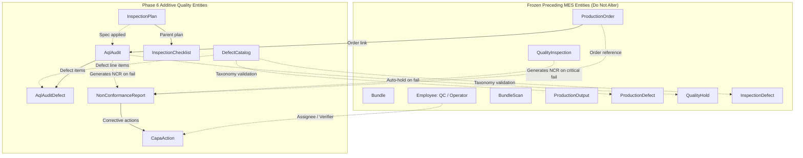

# Phase 6 — Forensic Audit: Quality Management Module

**Document Version:** 1.0.0  
**Audit Date:** September 10, 2026  
**Status:** FORENSIC AUDIT COMPLETE — AWAITING AUTHORIZATION  
**Scope:** Complete repository inspection of existing Quality and MES infrastructure to delineate current capabilities, identify genuine architectural gaps, avoid duplicate models, and specify the exact additive implementation plan for **Phase 6 — Quality Management**.

---

## 1. Executive Summary

A comprehensive forensic audit of the repository was conducted across the PostgreSQL database schema (`schema.prisma`), NestJS API modules (`quality`, `production`, `production/analytics`, `downtime`, `iam`), Next.js frontend pages and hooks, and all 19 existing E2E test suites (165 passing tests).

### Audit Verdict: **READINESS CONFIRMED (CLEAN ADDITIVE EXPANSION REQUIRED)**

1. **Preceding Baselines Frozen:**
   - Phase 5.6 (Production Output, Defects & Quality Holds): 12/12 E2E tests passed.
   - Phase 5.7 (MES Production Analytics): 10/10 E2E tests passed.
   - Phase 5.8 (MES Shift, Capacity & Scheduling Control): 16/16 E2E tests passed.
   - Full regression: **19/19 suites, 165/165 tests passed**.
   - Frontend TypeScript: 0 errors, ESLint: 0 errors/warnings, Production Build: 29/29 routes generated.
2. **Current Quality Baseline in Codebase:**
   - The repository **already contains** foundational shop-floor inline inspection and hold capabilities introduced in Phase 5.5 and Phase 5.6: `QualityInspection`, `InspectionDefect`, `ProductionOutput`, `ProductionDefect`, and `QualityHold`.
   - The repository **already enforces** workstation bundle scan blocking when bundles or orders are on quality hold, logs WIP `REJECT` transactions upon piece rejection, and aggregates quality KPIs (First Pass Yield, Defect Rate %, Defect Pareto, Active Hold Counts) in Phase 5.7.
3. **What is Genuinely Missing (Phase 6 Scope):**
   - **Defect Master Catalog & Taxonomy (`DefectCatalog` / `DefectCategory`):** Defect codes are currently unstructured strings with hardcoded frontend arrays (`DEFECT_CODES`). An enterprise apparel quality module requires a centralized, configurable taxonomy with departments (`FABRIC`, `CUTTING`, `SEWING`, `FINISHING`, `PACKING`), standardized codes, names, and default severities.
   - **Inspection Plans & Specifications (`InspectionPlan` & `InspectionChecklist`):** Inspections currently have no predefined criteria, checklist questions, or tolerances linked to styles, operations, or inspection stages (`IN_LINE`, `END_LINE`, `PRE_FINAL`, `FINAL_AUDIT`, `FABRIC_INSPECTION`).
   - **AQL Sampling Standards & Acceptance Engine (ISO 2859-1 / ANSI/ASQ Z1.4):** Statistical acceptance sampling tables (Lot size bands, General Inspection Levels I/II/III, Sample Size Code Letters, $Ac/Re$ thresholds for Critical, Major, Minor AQL levels) are completely absent.
   - **AQL Final Audits (`AqlAudit` / `AqlAuditDefect`):** Formal pre-shipment/lot acceptance audits executed against completed orders or packing lots.
   - **Non-Conformance Reports (NCR) & CAPA (`NonConformanceReport` & `CapaAction`):** Formal corrective and preventive action workflows (`DRAFT` $\rightarrow$ `OPEN` $\rightarrow$ `UNDER_INVESTIGATION` $\rightarrow$ `CAPA_ASSIGNED` $\rightarrow$ `VERIFIED` $\rightarrow$ `CLOSED`) with root-cause analysis (5-Whys), action assignment, due dates, and closure verification.
4. **Anti-Duplication Constraint:**
   - Existing tables (`QualityInspection`, `InspectionDefect`, `ProductionDefect`, `QualityHold`) must **NOT** be duplicated, renamed, or destroyed.
   - Phase 6 additions must seamlessly link with existing entities via additive relations.

---

## 2. Current Quality Inventory & State Assessment

### A. Database Models & Schema (`packages/database/prisma/schema.prisma`)

| Model | Existing Fields | Relationships | Current Operational Role | Phase 6 Status |
|---|---|---|---|---|
| `QualityInspection` | `id`, `tenantId`, `bundleId`, `productionOrderId`, `operationId`, `inspectorId`, `machineId`, `result` (`PASS`, `FAIL`), `inspectedQty`, `passedQty`, `rejectedQty`, `notes`, `idempotencyKey`, `createdAt`, `updatedAt` | `bundle`, `productionOrder`, `operation`, `inspector` (`Employee`), `machine`, `defects` (`InspectionDefect[]`) | Records inline workstation bundle inspection. Deducts rejected scrap from bundle pieces, increments operation `defectiveQty`, logs WIP `REJECT` transaction, triggers automatic bundle hold on `FAIL`. | **PRESERVED & FROZEN** (Authoritative inline inspection model). |
| `InspectionDefect` | `id`, `tenantId`, `inspectionId`, `defectCode` (`String`), `severity` (`MINOR`, `MAJOR`, `CRITICAL`), `quantity`, `notes`, `createdAt` | `inspection` (`QualityInspection`) | Logs defect items associated with a specific `QualityInspection`. | **PRESERVED & FROZEN**. Code values will validate against new `DefectCatalog`. |
| `ProductionOutput` | `id`, `tenantId`, `productionOrderId`, `bundleId`, `operationId`, `goodQuantity`, `defectiveQuantity`, `operatorId`, `timestamp`, `notes`, `idempotencyKey` | `productionOrder`, `bundle`, `operation`, `operator` (`Employee`), `defects` (`ProductionDefect[]`) | Records MES piece output and scraps at operations. | **PRESERVED & FROZEN**. |
| `ProductionDefect` | `id`, `tenantId`, `productionOrderId`, `bundleId`, `operationId`, `productionOutputId`, `defectCode` (`String`), `quantity`, `status` (`OPEN`, `REWORK`, `REJECTED`, `RESOLVED`), `remarks`, `createdAt`, `updatedAt` | `productionOrder`, `bundle`, `operation`, `productionOutput` | General defect register for shop-floor tracking and rework logging. | **PRESERVED & FROZEN**. |
| `QualityHold` | `id`, `tenantId`, `productionOrderId`, `bundleId`, `reason`, `status` (`ACTIVE`, `RELEASED`, `REJECTED`), `heldById`, `releasedById`, `heldAt`, `releasedAt`, `releaseRemarks`, `idempotencyKey` | `productionOrder`, `bundle`, `heldBy` (`Employee`), `releasedBy` (`Employee`) | Authoritative order-level or bundle-level quality hold. Blocks shop-floor bundle scans. | **PRESERVED & FROZEN**. Can be referenced by failed AQL audits or NCRs. |
| `Bundle` | `isQualityHold` (`Boolean`), `qualityHoldReason` (`String?`) | Linked to `qualityInspections`, `productionOutputs`, `qualityHolds` | Flag checked by `BundleScan` to reject scanning when on hold. | **PRESERVED & FROZEN**. |

### B. Existing Backend APIs

| Route | Method | Module / Controller | Purpose |
|---|---|---|---|
| `/quality/inspections` | `POST` | `QualityController` | Records inline inspection, validates bundle quantity balance, deducts scrap, applies auto-hold. |
| `/quality/inspections` | `GET` | `QualityController` | Queries inspection history with filters (`bundleId`, `productionOrderId`, `operationId`, `inspectorId`, `result`, dates). |
| `/quality/inspections/:id` | `GET` | `QualityController` | Retrieves single inspection record with defect line items. |
| `/quality/bundles/:id/hold` | `POST` | `QualityController` | Applies manual quality hold to a bundle. |
| `/quality/bundles/:id/release-hold` | `POST` | `QualityController` | Releases manual quality hold with resolution notes. |
| `/quality/stats/defects` | `GET` | `QualityController` | Aggregates inspection counts, pass/rejection rate %, and defect Pareto ranking. |
| `/quality/bundles/:id/history` | `GET` | `QualityController` | Retrieves bundle quality audit trail (inspections + hold audit events). |
| `/production/output` | `POST` / `GET` | `ProductionController` | Records and retrieves production output with defective counts. |
| `/production/defects` | `POST` / `GET` | `ProductionController` | Logs and filters production defects with status lifecycle (`OPEN`, `REWORK`, etc.). |
| `/production/quality-holds` | `POST` / `GET` | `ProductionController` | Applies order-level quality holds. |
| `/production/quality-holds/:id/release` | `POST` | `ProductionController` | Releases order-level quality hold. |
| `/production/analytics/quality` | `GET` | `ProductionAnalyticsController` | Aggregates totalGood, totalDefective, defectRate %, activeQualityHoldsCount, top defect Pareto. |

### C. Existing Frontend Pages & Navigation

| Route | Component | Role |
|---|---|---|
| `/production/quality` | `apps/web/app/production/quality/page.tsx` | Comprehensive inline quality terminal with tabs for: 1. Terminal (barcode scan, pass/fail, defect entry), 2. Active Holds, 3. Inspection History, 4. Pareto Defect breakdown. |
| `/production/defects` | `apps/web/app/production/defects/page.tsx` | Production defect register with order filtering, status badges (`OPEN`, `REWORK`, `RESOLVED`, `SCRAP`), and add defect dialog. |
| `/production/output` | `apps/web/app/production/output/page.tsx` | Workstation output entry with good/defective piece reporting. |
| `/production/operations` | `apps/web/app/production/operations/page.tsx` | Operations Command Center displaying live Quality KPI cards (Defect Rate %, Active Holds, Defect Pareto chart). |

### D. Existing Permissions & RBAC

- Seeded in `packages/database/prisma/seed.ts` and active in database:
  - `QUALITY:READ`
  - `QUALITY:WRITE`
  - `QUALITY:HOLD`

---

## 3. Search Term Findings Across Repository

| Search Query | Present in Codebase? | Location / Findings |
|---|---|---|
| **Quality** | **YES** | `QualityInspection`, `QualityHold`, `QualityModule`, `quality.e2e-spec.ts`, `/production/quality`, `/production/analytics/quality`. |
| **QC** | **YES** | `EmployeeType.QC`, inspector type filtering, role assignments. |
| **Inspection** | **YES** | `QualityInspection`, `InspectionDefect`, `InspectionResult` (`PASS`, `FAIL`). |
| **Defect** | **YES** | `InspectionDefect`, `ProductionDefect`, `DefectSeverity`, `DefectStatus`. |
| **DefectReason** | **NO** | Currently defect codes are raw strings (e.g. `SEAM_PUCKERING`, `BROKEN_STITCH`) without a master catalog table. |
| **NonConformance / NCR** | **NO** | Zero occurrences in schema, controllers, or tests. Genuinely missing enterprise feature. |
| **QualityHold** | **YES** | Model `QualityHold`, `Bundle.isQualityHold`, endpoints `/quality/bundles/:id/hold`, `/production/quality-holds`. |
| **Rework** | **YES** | Status value `DefectStatus.REWORK` in `ProductionDefect`. |
| **Rejection** | **YES** | Status value `DefectStatus.REJECTED`, WIP `REJECT` transactions, `QualityInspection.rejectedQty`. |
| **InspectionPlan** | **NO** | Zero occurrences in schema or controllers. Genuinely missing enterprise feature. |
| **InspectionResult** | **YES** | Enum `InspectionResult` (`PASS`, `FAIL`). |
| **Sampling** | **NO** | Zero occurrences in schema or controllers. Genuinely missing enterprise feature. |
| **AQL** | **NO** | Mentioned only in initial architectural roadmap (`docs/architecture/PHASE-0-FORENSIC-AUDIT.md`), no schema models or logic exist. |
| **CAPA** | **NO** | Zero occurrences in schema, controllers, or tests. Genuinely missing enterprise feature. |

---

## 4. Gap Analysis: What Phase 6 Genuinely Requires

### Gap 1: Master Defect Catalog & Taxonomy (`DefectCatalog`)
- **Current Issue**: Both inline inspections (`QualityInspection`) and defect register (`ProductionDefect`) accept free-form `defectCode: String`. The frontend hardcodes static arrays (`DEFECT_CODES = [...]`).
- **Phase 6 Requirement**: An authoritative `DefectCatalog` master table per tenant.
  - Categorization: `FABRIC`, `CUTTING`, `SEWING`, `WASHING`, `FINISHING`, `PACKING`, `MEASUREMENT`, `GENERAL`.
  - Attributes: Standardized code (e.g. `DEF-SEW-001`), name, category, default severity (`MINOR`, `MAJOR`, `CRITICAL`), description, active status.
  - Backwards compatible: Existing string `defectCode` fields remain valid, but the system now validates against and pulls metadata from `DefectCatalog`.

### Gap 2: Inspection Specifications & Checklists (`InspectionPlan` & `InspectionChecklist`)
- **Current Issue**: Quality inspections are performed ad-hoc without structured standards or checklists. A QC inspector has no guideline of what to inspect at which production stage.
- **Phase 6 Requirement**:
  - `InspectionPlan`: Templates or style-specific inspection protocols.
    - Specifies inspection stage: `IN_LINE`, `END_LINE`, `PRE_FINAL`, `FINAL_AUDIT`, `FABRIC_INSPECTION`.
    - Specifies target AQL level (e.g. 2.5) and inspection level (`LEVEL_I`, `LEVEL_II`, `LEVEL_III`).
  - `InspectionChecklist`: Ordered checklist items within a plan.
    - Checkpoint name (e.g. "Stitch Density SPI", "Seam Strength", "Care Label Barcode Scannability", "Sleeve Length Tolerance").
    - Standard specification, tolerance range, and defect severity rating if failed.

### Gap 3: ANSI/ASQ Z1.4 / ISO 2859-1 Statistical AQL Engine
- **Current Issue**: No statistical sampling standard exists in the system. Everything is either 100% inspected or arbitrary quantities.
- **Phase 6 Requirement**: An authoritative, deterministic AQL sampling calculator:
  - Supports General Inspection Levels I, II, III (Default: Normal Level II).
  - Determines Sample Size Code Letter (A through S) based on Lot Size.
  - Computes required Sample Size ($n$) and Acceptance/Rejection thresholds ($Ac/Re$) for given AQL percentages (e.g., Critical: 0 / AQL 0, Major: AQL 2.5, Minor: AQL 4.0).
  - Provides a stateless calculation endpoint `GET /quality/aql/calculate` and powers AQL Audit execution.

### Gap 4: AQL Final Lot Audits (`AqlAudit` & `AqlAuditDefect`)
- **Current Issue**: There is no capability to perform lot-level final acceptance audits on finished production orders before shipment.
- **Phase 6 Requirement**:
  - `AqlAudit`: Records audit of a production order lot.
  - Tracks lot size, sample size, auditor employee, inspection date, critical/major/minor defect counts, max allowed thresholds, and final determination (`PASSED`, `FAILED`, `PENDING_REWORK`).
  - On failure, allows auto-triggering an order-level `QualityHold` and/or creating a Non-Conformance Report (NCR).

### Gap 5: Non-Conformance Reports (NCR) & CAPA Action Tracking
- **Current Issue**: Systemic quality failures, critical defect clusters, or audit rejections have no formal remediation workflow.
- **Phase 6 Requirement**:
  - `NonConformanceReport` (NCR):
    - Tracks non-conformance incidents sourced from: `INLINE_INSPECTION`, `AQL_AUDIT`, `CUSTOMER_COMPLAINT`, `MATERIAL_DEFECT`, `INTERNAL_AUDIT`.
    - Structured lifecycle: `DRAFT` $\rightarrow$ `OPEN` $\rightarrow$ `UNDER_INVESTIGATION` $\rightarrow$ `CAPA_ASSIGNED` $\rightarrow$ `VERIFIED` $\rightarrow$ `CLOSED`.
    - Captures root-cause analysis (5-Whys / Ishikawa summary) and immediate containment action.
  - `CapaAction`:
    - Specific tasks: Corrective, Preventive, Containment.
    - Assigned employee, due date, completion notes, verification notes, verified by employee, status (`PENDING`, `IN_PROGRESS`, `COMPLETED`, `VERIFIED`).
    - Business Rule: An NCR **cannot** be transitioned to `CLOSED` until all associated CAPA actions have been completed and verified.

---

## 5. Anti-Duplication Architecture & Safeguards



### Critical Rules to Avoid Conceptual Duplication:
1. **`QualityInspection` vs `AqlAudit`**:
   - `QualityInspection` = **Micro-level / Workstation inline check** (single bundle at a specific sewing/finishing operation).
   - `AqlAudit` = **Macro-level / Finished lot acceptance audit** (statistical sample from an entire production order according to ISO 2859-1 AQL standards).
   - They do **not** overlap; both are essential in apparel manufacturing.
2. **`QualityHold` Reusability**:
   - Do **NOT** create an "AuditHold" or "NcrHold".
   - Reuse `QualityHold`. A failed `AqlAudit` or an open `NonConformanceReport` can create or reference an authoritative `QualityHold` record.
3. **`InspectionDefect` vs `ProductionDefect` vs `AqlAuditDefect`**:
   - `InspectionDefect` is the child of `QualityInspection`.
   - `ProductionDefect` is the child of `ProductionOutput`.
   - `AqlAuditDefect` is the child of `AqlAudit`.
   - All three reference the standardized `defectCode` string from `DefectCatalog`.

---

## 6. Proposed Additive Schema Specifications

```prisma
// -----------------------------------------------------------------------------
// QUALITY MANAGEMENT (PHASE 6)
// -----------------------------------------------------------------------------

enum DefectCategory {
  FABRIC
  CUTTING
  SEWING
  WASHING
  FINISHING
  PACKING
  MEASUREMENT
  GENERAL
}

enum InspectionStage {
  IN_LINE
  END_LINE
  PRE_FINAL
  FINAL_AUDIT
  FABRIC_INSPECTION
}

enum AqlAuditStatus {
  DRAFT
  PASSED
  FAILED
  PENDING_REWORK
}

enum NcrSource {
  INLINE_INSPECTION
  AQL_AUDIT
  CUSTOMER_COMPLAINT
  MATERIAL_DEFECT
  INTERNAL_AUDIT
}

enum NcrStatus {
  DRAFT
  OPEN
  UNDER_INVESTIGATION
  CAPA_ASSIGNED
  VERIFIED
  CLOSED
}

enum CapaType {
  CONTAINMENT
  CORRECTIVE
  PREVENTIVE
}

enum CapaStatus {
  PENDING
  IN_PROGRESS
  COMPLETED
  VERIFIED
}

model DefectCatalog {
  id              String         @id @default(uuid())
  tenantId        String
  code            String         // e.g. "DEF-SEW-001", "SEAM_PUCKERING"
  name            String         // e.g. "Seam Puckering"
  category        DefectCategory
  defaultSeverity DefectSeverity @default(MAJOR)
  description     String?
  active          Boolean        @default(true)
  createdAt       DateTime       @default(now())
  updatedAt       DateTime       @updatedAt

  tenant Tenant @relation(fields: [tenantId], references: [id], onDelete: Restrict)

  @@unique([tenantId, code])
  @@index([tenantId, category])
  @@index([tenantId, active])
}

model InspectionPlan {
  id              String          @id @default(uuid())
  tenantId        String
  styleId         String?         // Specific to style, or general template if null
  code            String          // e.g. "PLAN-POLO-FINAL"
  name            String          // e.g. "Polo Shirt Final Inspection Protocol"
  stage           InspectionStage @default(FINAL_AUDIT)
  aqlLevel        Decimal         @db.Decimal(4, 2) @default(2.5)
  inspectionLevel String          @default("LEVEL_II") // "LEVEL_I", "LEVEL_II", "LEVEL_III"
  active          Boolean         @default(true)
  createdAt       DateTime        @default(now())
  updatedAt       DateTime        @updatedAt

  tenant     Tenant                @relation(fields: [tenantId], references: [id], onDelete: Restrict)
  style      Style?                @relation(fields: [styleId], references: [id], onDelete: SetNull)
  checklists InspectionChecklist[]
  aqlAudits  AqlAudit[]

  @@unique([tenantId, code])
  @@index([tenantId, styleId])
  @@index([tenantId, stage])
}

model InspectionChecklist {
  id          String         @id @default(uuid())
  planId      String
  checkpoint  String         // e.g. "SPI (Stitches Per Inch) verification"
  standard    String?        // e.g. "10-12 stitches per inch"
  tolerance   String?        // e.g. "+/- 1 stitch"
  severity    DefectSeverity @default(MAJOR)
  sequence    Int            @default(1)

  plan InspectionPlan @relation(fields: [planId], references: [id], onDelete: Cascade)

  @@index([planId, sequence])
}

model AqlAudit {
  id                 String          @id @default(uuid())
  tenantId           String
  productionOrderId  String
  planId             String?
  auditNumber        String          // e.g. "AUD-2026-0001"
  stage              InspectionStage @default(FINAL_AUDIT)
  inspectionLevel    String          @default("LEVEL_II")
  lotSize            Int
  sampleSize         Int
  aqlMajor           Decimal         @db.Decimal(4, 2) @default(2.5)
  aqlMinor           Decimal         @db.Decimal(4, 2) @default(4.0)
  maxAllowedCritical Int             @default(0)
  maxAllowedMajor    Int
  maxAllowedMinor    Int
  criticalDefects    Int             @default(0)
  majorDefects       Int             @default(0)
  minorDefects       Int             @default(0)
  status             AqlAuditStatus  @default(DRAFT)
  auditorId          String
  auditDate          DateTime        @default(now())
  notes              String?
  idempotencyKey     String
  createdAt          DateTime        @default(now())
  updatedAt          DateTime        @updatedAt

  tenant          Tenant                 @relation(fields: [tenantId], references: [id], onDelete: Restrict)
  productionOrder ProductionOrder        @relation(fields: [productionOrderId], references: [id], onDelete: Restrict)
  plan            InspectionPlan?        @relation(fields: [planId], references: [id], onDelete: SetNull)
  auditor         Employee               @relation(fields: [auditorId], references: [id], onDelete: Restrict)
  defects         AqlAuditDefect[]
  ncrs            NonConformanceReport[]

  @@unique([tenantId, auditNumber])
  @@unique([tenantId, idempotencyKey])
  @@index([tenantId, productionOrderId])
  @@index([tenantId, status])
  @@index([tenantId, auditDate])
}

model AqlAuditDefect {
  id         String         @id @default(uuid())
  tenantId   String
  auditId    String
  defectCode String
  severity   DefectSeverity @default(MAJOR)
  quantity   Int
  notes      String?

  audit AqlAudit @relation(fields: [auditId], references: [id], onDelete: Cascade)

  @@index([tenantId, auditId])
  @@index([tenantId, defectCode])
}

model NonConformanceReport {
  id                   String         @id @default(uuid())
  tenantId             String
  ncrNumber            String         // e.g. "NCR-2026-0001"
  title                String
  source               NcrSource
  severity             DefectSeverity @default(MAJOR)
  status               NcrStatus      @default(OPEN)
  productionOrderId    String?
  bundleId             String?
  qualityInspectionId  String?
  aqlAuditId           String?
  description          String
  rootCause            String?        // 5-Whys analysis summary
  containmentAction    String?        // Immediate containment step
  createdById          String
  assignedToId         String?
  targetResolutionDate DateTime?
  resolvedAt           DateTime?
  closedAt             DateTime?
  idempotencyKey       String
  createdAt            DateTime       @default(now())
  updatedAt            DateTime       @updatedAt

  tenant            Tenant             @relation(fields: [tenantId], references: [id], onDelete: Restrict)
  productionOrder   ProductionOrder?   @relation(fields: [productionOrderId], references: [id], onDelete: SetNull)
  bundle            Bundle?            @relation(fields: [bundleId], references: [id], onDelete: SetNull)
  qualityInspection QualityInspection? @relation(fields: [qualityInspectionId], references: [id], onDelete: SetNull)
  aqlAudit          AqlAudit?          @relation(fields: [aqlAuditId], references: [id], onDelete: SetNull)
  createdBy         Employee           @relation("NcrCreator", fields: [createdById], references: [id], onDelete: Restrict)
  assignedTo        Employee?          @relation("NcrAssignee", fields: [assignedToId], references: [id], onDelete: SetNull)
  capaActions       CapaAction[]

  @@unique([tenantId, ncrNumber])
  @@unique([tenantId, idempotencyKey])
  @@index([tenantId, productionOrderId])
  @@index([tenantId, status])
  @@index([tenantId, source])
}

model CapaAction {
  id                String     @id @default(uuid())
  tenantId          String
  ncrId             String
  actionType        CapaType   @default(CORRECTIVE)
  description       String
  assigneeId        String
  dueDate           DateTime
  status            CapaStatus @default(PENDING)
  completionNotes   String?
  completedAt       DateTime?
  verifiedById      String?
  verifiedAt        DateTime?
  verificationNotes String?
  createdAt         DateTime   @default(now())
  updatedAt         DateTime   @updatedAt

  ncr        NonConformanceReport @relation(fields: [ncrId], references: [id], onDelete: Cascade)
  assignee   Employee             @relation("CapaAssignee", fields: [assigneeId], references: [id], onDelete: Restrict)
  verifiedBy Employee?            @relation("CapaVerifier", fields: [verifiedById], references: [id], onDelete: SetNull)

  @@index([tenantId, ncrId])
  @@index([tenantId, status])
  @@index([tenantId, assigneeId])
}
```

---

## 7. Proposed Backend Architecture & Endpoints

All new controllers and services will be housed cleanly inside `apps/api/src/quality/`:

```
apps/api/src/quality/
├── quality.module.ts              // Updated to register new controllers & services
├── quality.controller.ts          // Existing frozen inline inspection endpoints
├── quality.service.ts             // Existing frozen inline inspection logic
├── quality.dto.ts                 // Existing DTOs
├── catalog/
│   ├── defect-catalog.controller.ts
│   ├── defect-catalog.service.ts
│   └── defect-catalog.dto.ts
├── plans/
│   ├── inspection-plans.controller.ts
│   ├── inspection-plans.service.ts
│   └── inspection-plans.dto.ts
├── aql/
│   ├── aql-engine.service.ts      // Deterministic ISO 2859-1 / ANSI/ASQ Z1.4 tables & math
│   ├── aql-audits.controller.ts
│   ├── aql-audits.service.ts
│   └── aql-audits.dto.ts
└── ncr/
    ├── ncr.controller.ts
    ├── ncr.service.ts
    └── ncr.dto.ts
```

### Proposed Endpoint Specifications:

| Method | Route | Permission | Description |
|---|---|---|---|
| `GET` | `/quality/catalog` | `QUALITY:READ` | Query active defect catalog codes with category filter. |
| `POST` | `/quality/catalog` | `QUALITY:WRITE` | Add new standardized defect code to catalog. |
| `PATCH` | `/quality/catalog/:id` | `QUALITY:WRITE` | Update defect metadata or active status. |
| `GET` | `/quality/plans` | `QUALITY:READ` | Query inspection plans and checklists. |
| `POST` | `/quality/plans` | `QUALITY:WRITE` | Create an inspection plan with ordered checklists. |
| `GET` | `/quality/plans/:id` | `QUALITY:READ` | Retrieve inspection plan with full checklist items. |
| `PATCH` | `/quality/plans/:id` | `QUALITY:WRITE` | Update inspection plan or checklist criteria. |
| `GET` | `/quality/aql/calculate` | `QUALITY:READ` | Deterministic AQL calculator: inputs `lotSize`, `inspectionLevel`, `aqlMajor`, `aqlMinor` $\rightarrow$ outputs `sampleSize`, `maxAllowedCritical`, `maxAllowedMajor`, `maxAllowedMinor`. |
| `POST` | `/quality/aql/audits` | `QUALITY:WRITE` | Execute AQL audit against order lot. Evaluates pass/fail. Supports optional auto-hold on fail. |
| `GET` | `/quality/aql/audits` | `QUALITY:READ` | Query AQL audits with filters (`productionOrderId`, `status`, `stage`, date range). |
| `GET` | `/quality/aql/audits/:id` | `QUALITY:READ` | Retrieve AQL audit details with defect breakdown. |
| `GET` | `/quality/ncr` | `QUALITY:READ` | Query NCRs with status, severity, source, order filters. |
| `POST` | `/quality/ncr` | `QUALITY:WRITE` | Raise a Non-Conformance Report. |
| `GET` | `/quality/ncr/:id` | `QUALITY:READ` | Retrieve NCR details with root-cause analysis and CAPA actions. |
| `PATCH` | `/quality/ncr/:id/status` | `QUALITY:WRITE` | Transition NCR lifecycle (`OPEN` $\rightarrow$ `UNDER_INVESTIGATION` $\rightarrow$ `CAPA_ASSIGNED` $\rightarrow$ `VERIFIED` $\rightarrow$ `CLOSED`). |
| `POST` | `/quality/ncr/:id/capa` | `QUALITY:WRITE` | Add a CAPA action task (Containment, Corrective, Preventive). |
| `PATCH` | `/quality/ncr/:id/capa/:capaId` | `QUALITY:WRITE` | Update CAPA action status (complete or verify). |

---

## 8. Proposed Frontend Routes & Pages

Under `apps/web/app/quality/` (or structured under `/production/quality`):

1. **`/quality/catalog` (Defect Master Catalog):**
   - Department and category badge filters (`FABRIC`, `SEWING`, `FINISHING`, etc.).
   - Defect code directory with search, severity indicator, and "Add Defect Code" dialog.
2. **`/quality/plans` (Inspection Plans & Protocols):**
   - Protocol cards grouped by stage (`IN_LINE`, `END_LINE`, `FINAL_AUDIT`).
   - Interactive checklist builder with standard, tolerance, and severity inputs.
3. **`/quality/aql` (AQL Lot Audit Workspace):**
   - Interactive ISO 2859-1 Sampling Calculator widget.
   - Audit recording terminal: Lot size entry $\rightarrow$ auto-calculates sample size $\rightarrow$ sample defect entry $\rightarrow$ live pass/fail outcome verdict.
   - Audit history table with lot acceptance rate metrics.
4. **`/quality/ncr` (Non-Conformance & CAPA Management):**
   - Kanban / Status board for NCR workflow (`OPEN` $\rightarrow$ `UNDER_INVESTIGATION` $\rightarrow$ `CAPA_ASSIGNED` $\rightarrow$ `VERIFIED` $\rightarrow$ `CLOSED`).
   - Detail drawer showing 5-Whys root-cause analysis, containment actions, and CAPA action progress.
5. **Sidebar Navigation Update (`apps/web/components/layout/sidebar.tsx`):**
   - Elevated `QUALITY CONTROL` navigation group containing:
     - Quality Terminal (`/production/quality` - inline checks)
     - AQL Lot Audits (`/quality/aql`)
     - Non-Conformance & CAPA (`/quality/ncr`)
     - Inspection Plans (`/quality/plans`)
     - Defect Catalog (`/quality/catalog`)

---

## 9. Integration with MES & Frozen Modules

1. **ProductionOutput & Completion (Phase 5.6):**
   - When output is recorded with defects, defect codes can be selected from `DefectCatalog`.
2. **Bundle Scanning & Workstations (Phase 5.4):**
   - When a bundle or order is placed on `QualityHold` (whether from inline failure, failed AQL audit, or open critical NCR), `BundleScan` continues to strictly reject workstation scans with HTTP 400 (`QUALITY HOLD: Cannot be scanned`).
3. **WIP Transactions & Scrap Conservation (Phase 5.4):**
   - Inline rejections decrement bundle quantity and create WIP `REJECT` transactions.
   - AQL audits inspect samples from finished orders and can route rejected lots to rework without mutating frozen WIP ledger history.
4. **Operations Command Center & Analytics (Phase 5.7 & 5.8):**
   - Quality analytics endpoints continue reading authoritative persisted records.
   - Extended to include AQL First-Time Acceptance % and Active NCR count.

---

## 10. Proposed E2E Test Strategy (`test/quality-management.e2e-spec.ts`)

A dedicated suite of 16-18 high-rigor tests validating:
1. **Defect Catalog Management:**
   - Create valid defect catalog code with category and severity.
   - Reject duplicate defect code within tenant (HTTP 409).
   - Filter catalog by department/category.
2. **Inspection Plan Specifications:**
   - Create inspection plan with ordered checklists and tolerances.
   - Validate plan retrieval by style and inspection stage.
3. **AQL Sampling Engine Math (ANSI/ASQ Z1.4 Level II):**
   - Verify lot 500 $\rightarrow$ sample 50, AQL 2.5 Ac=3, Re=4.
   - Verify lot 1,000 $\rightarrow$ sample 80, AQL 2.5 Ac=5, Re=6.
   - Verify lot 3,200 $\rightarrow$ sample 125, AQL 2.5 Ac=7, Re=8.
   - Verify critical defect threshold ($Ac=0, Re=1$).
4. **AQL Audit Positive Flow (PASSED):**
   - Record audit with sample defects $\le Ac$ threshold $\rightarrow$ audit marked `PASSED`.
   - Order remains in active release state.
5. **AQL Audit Failure Flow (FAILED) & Auto-Hold:**
   - Record audit with major defects $\ge Re$ threshold $\rightarrow$ audit marked `FAILED`.
   - Auto-applies `QualityHold` to production order.
6. **AQL Idempotency & Repeat Key Protection:**
   - Repeat `x-idempotency-key` returns identical audit record without duplication.
7. **Non-Conformance Report (NCR) Lifecycle:**
   - Create NCR linked to failed AQL audit and order.
   - Transition status `OPEN` $\rightarrow$ `UNDER_INVESTIGATION` $\rightarrow$ `CAPA_ASSIGNED`.
8. **CAPA Action Task Workflow:**
   - Add corrective and preventive action tasks to NCR.
   - Complete CAPA task with completion notes.
   - Verify CAPA task with verifier employee.
9. **NCR Closure Guard (Business Rule):**
   - Attempting to transition NCR to `CLOSED` when unverified CAPA actions exist fails with HTTP 400.
   - Successfully closing NCR once all CAPAs are verified.
10. **Cross-Tenant IDOR Protection:**
    - Tenant B cannot view or audit Tenant A's orders, plans, or NCRs (HTTP 404).
11. **RBAC Authorization:**
    - Unauthorized user cannot perform AQL audit or close NCR (HTTP 403).

---

## 11. Open Questions Requiring User Approval

Before any code implementation is authorized, the following design options should be reviewed:
1. **AQL Standard Level:** The default standard proposed is ANSI/ASQ Z1.4 Normal Inspection Level II (single sampling plan). Does the factory require Double Sampling Plans or Normal/Tightened/Reduced switching rules for Phase 6, or is Single Normal Level II sufficient? (Single Normal Level II is industry standard for Phase 6).
2. **NCR Auto-Generation:** Should failed AQL audits *automatically* generate a draft NCR, or should the QC Auditor manually click "Raise NCR" from the audit screen? (Recommended: Prompt auditor with a one-click "Raise NCR" pre-filled with the audit failure details).
3. **Defect Catalog Seeding:** Should we pre-seed standard apparel defect codes (e.g. 20 common sewing, fabric, and finishing defects) in `seed.ts` so the system is immediately usable out of the box? (Recommended: Yes).

---

## 12. Verification & Completion Gate

> [!IMPORTANT]
> **Audit Gate:** This audit document is complete. In strict adherence to the prompt instructions:
> - **ZERO** production code, database migrations, controllers, services, frontend pages, or tests have been created for Phase 6.
> - Execution is **STOPPED** pending explicit user review and authorization.
