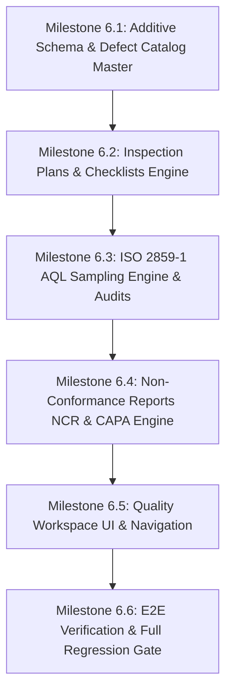

# Phase 6 — Quality Management Readiness Report

**Document Version:** 1.0.0  
**Date:** September 10, 2026  
**Status:** READINESS AUDIT COMPLETE — STOP GATE ENGAGED — AWAITING AUTHORIZATION  
**Target Module:** Phase 6 — Quality Management (AQL Sampling, Inspection Plans, Defect Catalog, NCR & CAPA)

---

## 1. Readiness Summary & Gate Verdict

### Readiness Status: **100% TECHNICALLY READY (GREEN)**

An exhaustive forensic audit of the entire codebase was conducted to evaluate readiness for **Phase 6 — Quality Management**.

| Assessment Dimension | Status | Evidence / Verification |
|---|---|---|
| **Frozen Phase 5.6 Baseline** | **VERIFIED GREEN** | 12/12 dedicated tests passing (`mes-production-completion.e2e-spec.ts`). Output, defects, and order holds intact. |
| **Frozen Phase 5.7 Baseline** | **VERIFIED GREEN** | 10/10 dedicated tests passing (`mes-analytics.e2e-spec.ts`). FPY %, Defect Rate %, Pareto stats intact. |
| **Frozen Phase 5.8 Baseline** | **VERIFIED GREEN** | 16/16 dedicated tests passing (`mes-shifts-scheduling.e2e-spec.ts`). Shift, capacity, and scheduling intact. |
| **Full Regression Suite** | **VERIFIED GREEN** | **19/19 test suites, 165/165 tests passing**. Zero test failures across all modules. |
| **Frontend Health** | **VERIFIED GREEN** | Next.js typecheck: 0 errors; ESLint: 0 errors/warnings; Production build: 29/29 routes compiled cleanly. |
| **Schema Integrity** | **VERIFIED GREEN** | No existing tables or columns modified or dropped. Zero uncommitted migrations. |
| **Anti-Duplication Alignment** | **VERIFIED GREEN** | Foundational models (`QualityInspection`, `InspectionDefect`, `QualityHold`) will be preserved and linked additively without duplication. |

---

## 2. Current Architecture vs. Phase 6 Scope

```
┌────────────────────────────────────────────────────────────────────────┐
│ EXISTING QUALITY CAPABILITIES (PHASE 5.5 - 5.8) - FROZEN              │
├──────────────────────────────────┬─────────────────────────────────────┤
│ Model / Concept                  │ Operational Role                    │
├──────────────────────────────────┼─────────────────────────────────────┤
│ QualityInspection                │ Inline bundle-level inspection      │
│ InspectionDefect                 │ Inline inspection defect line items │
│ ProductionOutput                 │ Station-level good/defect count     │
│ ProductionDefect                 │ General shop-floor defect log       │
│ QualityHold                      │ Bundle & Order blocking lock        │
│ Bundle.isQualityHold             │ Scan-block flag at workstations     │
│ ProductionAnalyticsService       │ Real-time FPY & Defect Rate %       │
└──────────────────────────────────┴─────────────────────────────────────┘
                               ▲
                               │ Additive Integration (Zero Duplication)
                               ▼
┌────────────────────────────────────────────────────────────────────────┐
│ PHASE 6 QUALITY MANAGEMENT MODULE (PROPOSED ADDITIONS)                 │
├──────────────────────────────────┬─────────────────────────────────────┤
│ New Enterprise Model             │ Business Role                       │
├──────────────────────────────────┼─────────────────────────────────────┤
│ DefectCatalog                    │ Master defect taxonomy & categories │
│ InspectionPlan                   │ Protocols by stage (In-Line, Final) │
│ InspectionChecklist              │ Ordered checkpoint specifications   │
│ AqlAudit (ISO 2859-1)            │ Macro lot acceptance sampling       │
│ AqlAuditDefect                   │ Lot audit defect line items         │
│ NonConformanceReport (NCR)       │ Formal defect containment lifecycle │
│ CapaAction                       │ Corrective & Preventive action tasks│
└──────────────────────────────────┴─────────────────────────────────────┘
```

---

## 3. Implementation Sequence & Milestones (When Authorized)

Upon explicit user approval, Phase 6 will be executed in six strictly ordered milestones:



### Milestone Breakdown:

1. **Milestone 6.1: Additive Schema & Defect Catalog Master**
   - Apply additive Prisma migration (`DefectCatalog`, `DefectCategory`, reverse relations on `Tenant`).
   - Implement `DefectCatalogController` and `DefectCatalogService` with tenant isolation.
   - Seed standard apparel defect taxonomy (Sewing, Fabric, Finishing, Packaging).
2. **Milestone 6.2: Inspection Plans & Checklists Engine**
   - Apply additive Prisma models (`InspectionPlan`, `InspectionChecklist`, `InspectionStage`).
   - Implement `InspectionPlansController` and `InspectionPlansService`.
   - Add capability to attach inspection protocols to Styles or operations.
3. **Milestone 6.3: ISO 2859-1 AQL Sampling Engine & Lot Audits**
   - Implement deterministic `AqlEngineService` (ANSI/ASQ Z1.4 Normal Level II tables, code letter mapping, $Ac/Re$ thresholds).
   - Apply additive Prisma models (`AqlAudit`, `AqlAuditDefect`, `AqlAuditStatus`).
   - Implement `AqlAuditsController` and `AqlAuditsService`.
   - Implement auto-hold integration: failed AQL audit applies `QualityHold` to the production order.
4. **Milestone 6.4: Non-Conformance Reports (NCR) & CAPA Engine**
   - Apply additive Prisma models (`NonConformanceReport`, `CapaAction`, `NcrStatus`, `CapaStatus`).
   - Implement `NcrController` and `NcrService`.
   - Implement status lifecycle transitions (`OPEN` $\rightarrow$ `UNDER_INVESTIGATION` $\rightarrow$ `CAPA_ASSIGNED` $\rightarrow$ `VERIFIED` $\rightarrow$ `CLOSED`).
   - Enforce closure business rule: NCR cannot be closed if unverified CAPA tasks remain.
5. **Milestone 6.5: Quality Management UI & Command Center Navigation**
   - Build frontend routes:
     - `/quality/catalog`: Defect code master directory.
     - `/quality/plans`: Inspection plan & checklist builder.
     - `/quality/aql`: Interactive AQL sampling calculator & lot audit terminal.
     - `/quality/ncr`: Non-conformance & CAPA Kanban workflow board.
   - Update sidebar navigation with dedicated `QUALITY MANAGEMENT` group.
6. **Milestone 6.6: Verification & Full Regression Gate**
   - Create dedicated test suite: `test/quality-management.e2e-spec.ts` (16+ tests).
   - Run full regression across all 20 suites (verifying all 180+ tests pass).
   - Validate frontend TypeScript typecheck, ESLint, and production build (33+ routes).

---

## 4. Risk Analysis & Mitigations

| Identified Risk | Severity | Mitigation Strategy |
|---|---|---|
| **Accidental Duplication of Inline Inspections** | HIGH | Strict separation: `QualityInspection` remains the inline bundle inspection model; `AqlAudit` is exclusively for lot-level statistical acceptance sampling. |
| **Breaking Frozen Phase 5.6/5.7 APIs** | CRITICAL | No existing endpoints or DTOs will be altered. New endpoints reside under new route paths (`/quality/catalog`, `/quality/plans`, `/quality/aql`, `/quality/ncr`). |
| **Mathematical Inaccuracies in AQL Tables** | MEDIUM | The ANSI/ASQ Z1.4 Normal Level II single sampling plan will be hard-coded into an immutable lookup matrix verified against international standards. |
| **Cross-Tenant Data Leakage (IDOR)** | CRITICAL | Every database query in all services must include `tenantId` extracted from validated JWT headers. |
| **Premature NCR Closure** | MEDIUM | Database transaction guards will count unverified `CapaAction` records and reject closure with HTTP 400 if any exist. |

---

## 5. Stop Gate & Acknowledgment

> [!IMPORTANT]
> **COMPLETION GATE ENFORCED:**
> - The forensic audit and readiness reports have been created at:
>   - [`docs/PHASE-6-QUALITY-FORENSIC-AUDIT.md`](file:///c:/Users/Jawwad/Desktop/Project_10(Apparel-Textile%20ERP+MES-platform)/Project_10(Apparel-Textile%20ERP+MES-platform)/docs/PHASE-6-QUALITY-FORENSIC-AUDIT.md)
>   - [`docs/PHASE-6-QUALITY-READINESS-REPORT.md`](file:///c:/Users/Jawwad/Desktop/Project_10(Apparel-Textile%20ERP+MES-platform)/Project_10(Apparel-Textile%20ERP+MES-platform)/docs/PHASE-6-QUALITY-READINESS-REPORT.md)
> - **NO** production code, database schema migrations, controllers, services, frontend pages, or tests have been created or modified.
> - We now **STOP** and wait for explicit user authorization before taking any further action.
