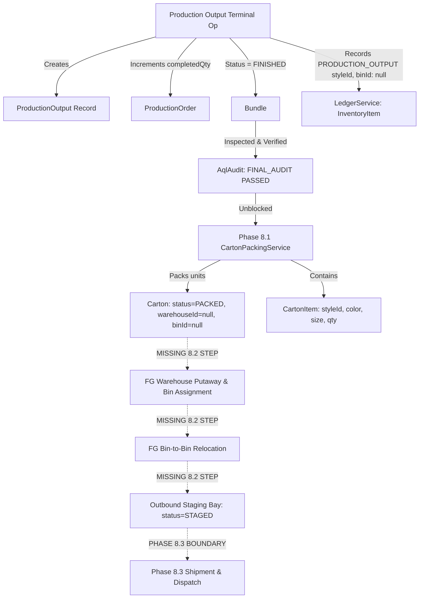

# PHASE 8.2 — FORENSIC AUDIT: FINISHED GOODS WAREHOUSE & STOCK STAGING
## COMPREHENSIVE BASELINE INVESTIGATION & DOMAIN AUDIT

**Audit Date**: September 22, 2026  
**Phase Context**: Sub-Phase 8.1 is COMPLETE and FROZEN. Sub-Phase 8.2 is in AUDIT ONLY mode.  
**Execution Guardrail**: Zero code modifications, schema changes, or 8.2/8.3 implementations permitted.

---

### EXECUTIVE SUMMARY

This forensic audit investigates the exact existing baseline across the inventory ledger, manufacturing output, packaging, and warehouse domains to establish the precise architectural foundation for:

**Phase 8.2 — Finished Goods Warehouse Control & Stock Staging**

The investigation revealed a critical architectural insight:
1. **Pre-Existing Ledger Credit in MES**: When the final sewing/washing/finishing operation is reported in MES (`recordProductionOutput`), `LedgerService.recordTransaction` is **already called** with `InventoryTxType.PRODUCTION_OUTPUT` for the order's `styleId` at the tenant level with `binId = null`. This means finished goods stock has already entered the tenant's global balance.
2. **Missing Warehouse & Bin Custody**: Although finished goods units exist in the tenant-level ledger, they possess **zero physical warehouse custody, zero bin assignment, and zero staging location**.
3. **Carton Isolation**: Phase 8.1 established discrete serialization (`Carton` with SSCC-18 and `CartonItem`), but cartons currently remain in an unassigned floor state (`warehouseId: null`, `binId: null`, `status: PACKED`).
4. **Sub-Phase 8.2 Responsibility**: Phase 8.2 must provide the authoritative physical warehouse custody layer—receiving packed cartons into finished goods warehouses, putting them away into specific bins/racks, executing bin-to-bin relocations, moving cartons to outbound staging docks/bays, and maintaining full chain-of-custody traceability while reconciling with `LedgerService`.

---

### 1. AUDIT OF EXISTING INVENTORY AUTHORITY

#### 1.1 `LedgerService` (`apps/api/src/inventory/services/ledger.service.ts`)
* **Sole Inventory Authority**: The repository strictly enforces that `LedgerService` is the single source of truth for stock quantities and financial valuations.
* **Materialized Balances (`InventoryItem`)**:
  * Fields: `id`, `tenantId`, `materialId?`, `styleId?`, `quantity (Decimal 12, 4)`, timestamps.
  * Notice: `InventoryItem` explicitly supports **both** raw materials (`materialId`) and finished garments (`styleId`).
  * Concurrency Protection: `lockInventoryItem` executes a pessimistic row lock (`SELECT quantity FROM "InventoryItem" ... FOR UPDATE`) before calculating changes.
  * Invariant: Rejects transactions that would result in negative stock (`currentQty + dbQuantityChange < 0`).
* **Append-Only Ledger (`InventoryTransaction`)**:
  * Fields: `id`, `tenantId`, `materialId?`, `styleId?`, `binId?`, `type (InventoryTxType)`, `quantity`, `uom`, `referenceId?`, `actorId`, `reason?`, `idempotencyKey?`, `timestamp`.
  * Indexes: `@@unique([tenantId, idempotencyKey])`, foreign keys to `Tenant` and `Bin`.
* **Transaction Types (`enum InventoryTxType`)**:
  * Existing enum values: `RECEIPT`, `TRANSFER_IN`, `TRANSFER_OUT`, `ISSUE`, `CONSUMPTION`, `RETURN`, `RESERVATION`, `RELEASE_RESERVATION`, `ADJUSTMENT`, `WASTAGE`, `PRODUCTION_OUTPUT`, `REVERSAL`.
  * Positive adjustments (`isIncrease = true`): `RECEIPT`, `TRANSFER_IN`, `RETURN`, `PRODUCTION_OUTPUT`.
  * Negative adjustments (`isIncrease = false`): `TRANSFER_OUT`, `ISSUE`, `CONSUMPTION`, `RESERVATION`, `WASTAGE`.
  * Bidirectional: `ADJUSTMENT`.

#### 1.2 Warehouse & Bin Data Model
* **`Warehouse`**:
  * Fields: `id`, `tenantId`, `code`, `name`, timestamps.
  * Unique: `@@unique([tenantId, code])`.
  * Existing relations: `tenant`, `bins Bin[]`, `goodsReceiptNotes Grn[]`, `fabricRolls FabricRoll[]`, `cartons Carton[]`.
  * Note: Contains no category or type field (clean Phase 8.1 state after removal of premature enum).
* **`Bin`**:
  * Fields: `id`, `warehouseId`, `code`, `name`, timestamps.
  * Unique: `@@unique([warehouseId, code])`.
  * Existing relations: `warehouse`, `inventoryTxns InventoryTransaction[]`, `grnLines GrnLine[]`, `fabricRolls FabricRoll[]`, `materialIssueLines[]`, `materialReturnLines[]`, `cartons Carton[]`.

#### 1.3 Material Inventory Workflows vs Finished Goods
* **Raw Materials** (Phases 3, 4, 7):
  * Received via `GoodsReceiptNote` (`GrnLine`) -> creates `RECEIPT` in `LedgerService`.
  * Fabric rolls tracked discretely in `FabricRoll` with `warehouseId`, `binId`, and `status: AVAILABLE`.
  * Reserved for production orders via `MaterialReservation` (`RESERVATION`).
  * Issued to production lines via `MaterialIssueNote` (`ISSUE`).
* **Finished Goods** (Phases 5.8, 8.1):
  * Created via `recordProductionOutput` at terminal operation -> creates `PRODUCTION_OUTPUT` on `styleId` in `LedgerService` with `binId = null`.
  * Grouped into containers via `Carton` and `CartonItem` in Phase 8.1 with `warehouseId = null`, `binId = null`, and `status = PACKED`.
  * **Gap**: There is currently no finished goods warehouse receipt, no bin putaway, no bin transfer, and no staging movement.

---

### 2. TRACE OF CURRENT FINISHED GOODS FLOW

#### Forensic Findings on Current Lifecycle:
1. **ProductionOutput creates aggregate FG stock**:
   - `production.service.ts:1267` executes:
     `ledgerService.recordTransaction(tx, { tenantId, styleId: order.buyerPoLine.styleId, type: InventoryTxType.PRODUCTION_OUTPUT, quantity: goodQty, uom: 'PCS', referenceId: output.id })`.
   - Result: Global `InventoryItem.quantity` for that style is immediately incremented upon sewing/finishing completion.
2. **Carton creation does not alter ledger quantities**:
   - In Phase 8.1, carton packing associates already-produced finished units into physical cartons with SSCC-18 serial numbers.
   - It validates quantity conservation against `order.completedQty`, but does not touch `LedgerService` (to prevent duplicate stock counting).
3. **Cartons currently lack physical custody**:
   - When cartons are packed, `warehouseId` and `binId` are null.
   - The system knows that 500 units were produced and 20 cartons were sealed, but cannot authoritatively answer: *"Which warehouse is carton CTN-001 stored in? Which rack/bin is it occupying? Is it ready in the dispatch staging area?"*
4. **Authoritative vs Metadata Location**:
   - In Phase 8.1, `warehouseId` and `binId` on `Carton` are passive foreign keys.
   - In Phase 8.2, they must become **server-authoritative physical custody locations**, validated against warehouse classification, bin capacity, and quality release status.

---

### 3. WAREHOUSE & BIN AUDIT: DISTINGUISHING FG FROM RAW MATERIAL

#### 3.1 Evaluation of Distinction Mechanisms
The audit evaluated four architectural approaches to distinguish Finished Goods warehouses and staging locations from Raw Material stores:

| Approach | Architectural Evaluation | Verdict |
|---|---|---|
| **1. Arbitrary Naming / Prefix (e.g. `WH-FG-*`)** | Fragile, non-authoritative. Cannot enforce database foreign key integrity or compile-time type safety. Prone to user error. | **REJECTED** |
| **2. Separate `FgWarehouse` Table** | Massive schema duplication. Requires duplicating `Bin`, foreign keys on `Carton`, inventory services, and IAM policies. | **REJECTED** |
| **3. Additive `WarehouseType` Enum on `Warehouse`** | Strictly additive, non-breaking. Enum values: `RAW_MATERIAL`, `FINISHED_GOODS`, `GENERAL` with `@default(GENERAL)`. Directly satisfies Phase 8 Decision #6. Allows server-authoritative validation preventing raw materials from being stored in FG facilities and vice versa. | **RECOMMENDED** |
| **4. Additive `BinType` Enum on `Bin`** | Allows finished goods warehouses to cleanly designate standard storage racks from staging lanes: `STORAGE`, `STAGING`, `QUARANTINE` with `@default(STORAGE)`. | **RECOMMENDED** |

#### 3.2 Technical Justification
* Reintroducing `WarehouseType` on `Warehouse` in **Sub-Phase 8.2** is mathematically sound because 8.2 is the exact phase responsible for Finished Goods Warehouse Control.
* In addition, introducing `BinType` on `Bin` enables server-side validation during outbound staging: only cartons transitioning to `STAGED` status can be placed into bins of type `STAGING`.

---

### 4. CARTON CUSTODY & LOCATION MODEL

#### 4.1 Sufficiency of Phase 8.1 Fields
In Phase 8.1, `Carton` has:
- `warehouseId String?`
- `binId String?`
- `status CartonStatus` (`DRAFT`, `PACKED`, `STAGED`, `SHIPPED`, `CANCELLED`)
- `productionOrderId String`
- `packingListId String?`
- `items CartonItem[]`
- `totalUnits Int`

#### 4.2 Gaps Identified for Phase 8.2 Custody Operations:
1. **Timestamped Custody State**:
   - `Carton` currently lacks explicit timestamps for warehouse lifecycle milestones: `receivedAt` (putaway into FG storage) and `stagedAt` (moved to outbound staging).
2. **Chain-of-Custody Movement Trail**:
   - If Carton A moves from `Floor -> Bin A1 -> Bin B3 -> Staging Dock 2`:
   - Updating `Carton.binId` overwrites previous location.
   - Regulated apparel supply chains (and tier-1 brand audits) require an immutable audit trail of who moved each carton, from where, to where, and when.
   - Recommended additive model: `model CartonMovement` (or `CartonCustodyLog`).

---

### 5. LEDGER DESIGN & INVENTORY AUTHORITIES

#### 5.1 Sole Authority Constraint
The cardinal rule of the Phase 8 architecture is:
> `LedgerService` must remain the sole inventory authority. Do NOT create a parallel inventory ledger.

#### 5.2 The FG Inventory Double-Counting Dilemma & Resolution
* **The Dilemma**:
  - `PRODUCTION_OUTPUT` has already incremented `InventoryItem.quantity` for `styleId` upon completion of manufacturing output.
  - If FG Warehouse Putaway creates an `InventoryTxType.RECEIPT`, the system will **double-count** finished goods inventory!
* **The Authoritative Resolution**:
  - **Option A (Carton Custody Model - Recommended)**:
    - `LedgerService` tracks global on-hand SKU balances via `InventoryItem` and append-only financial/audit events via `InventoryTransaction`.
    - `Carton` and `CartonItem` track the discrete, serialized physical containment and bin custody.
    - Physical warehouse putaway and staging are modeled as authoritative carton custody state transitions (`Carton.warehouseId`, `Carton.binId`, `Carton.status = STAGED`, `CartonMovement`).
    - When a carton is physically transferred between bins, a `CartonMovement` record is logged, and an optional ledger transaction of types `TRANSFER_OUT` / `TRANSFER_IN` with `styleId` can be recorded if bin-level financial accounting is required.
    - Result: Absolute quantity conservation with zero double-counting.

---

### 6. QUANTITY RECONCILIATION INVARIANTS

Phase 8.2 must implement strict mathematical invariants enforced within atomic database transactions:

1. **Production Output to Carton Reconciliation**:
   $$\sum \text{CartonItem.quantity} \le \text{ProductionOrder.completedQty}$$
   No carton can be packed or put away if the total units packed for that order exceed actual verified production output.
2. **Discrete Container Exclusivity**:
   A carton can occupy exactly **one** warehouse and **one** bin at any instant in time:
   $$\text{Carton.binId} \implies \text{Bin.warehouseId} == \text{Carton.warehouseId}$$
3. **Immutability of Terminal States**:
   Cartons in status `CANCELLED` or `SHIPPED` can NEVER be received, put away, relocated, or staged.
4. **Staging Invariant**:
   A carton can only be placed into a `STAGING` bin if its status is transitioned to `STAGED`.
   Conversely, a carton cannot be in `STAGED` status while residing in a non-staging storage rack.
5. **No Negative Bin / Warehouse Quantities**:
   Removing a carton from a bin atomically decrements that bin's carton count and piece count, verified to never fall below zero.

---

### 7. QUALITY GATE & PACKING DEPENDENCIES

Phase 8.2 must inherit and enforce the hard quality releases established in Phase 6 and frozen in Phase 8.1:

1. **Pre-Putaway Quality Gate**:
   - Before a carton is accepted into FG warehouse custody, the system must assert:
     - Linked `ProductionOrder` has no active `QualityHold`.
     - None of the items in the carton reference a bundle with an active `QualityHold` or `bundle.isQualityHold == true`.
     - Production order retains its verified passing `FINAL_AUDIT` AQL release.
2. **Pre-Staging Quality Gate (Critical Pre-Shipping Gate)**:
   - If an order or bundle is placed under a retroactive `QualityHold` after carton packing (e.g. customer stop-ship order or post-pack audit NCR), **moving that carton to the Outbound Staging dock MUST be server-side blocked with HTTP 409 Conflict**.
   - No held or unreleased material may ever enter the outbound staging area.

---

### 8. RBAC, TENANCY & IDEMPOTENCY

1. **Permissions**:
   - Existing: `WAREHOUSE:READ`, `WAREHOUSE:WRITE`, `PACKING:READ`, `PACKING:WRITE`, `INVENTORY:READ`, `INVENTORY:WRITE`.
   - Phase 8.2 actions map cleanly to existing permissions:
     - Viewing FG warehouse stock and bin maps: `WAREHOUSE:READ` or `PACKING:READ`.
     - Executing putaway, relocation, and staging: `WAREHOUSE:WRITE` or `PACKING:WRITE`.
2. **Tenant Isolation**:
   - All queries and mutations for cartons, bins, warehouses, and movements MUST be scoped by `tenantId`.
   - Cross-tenant putaway (e.g. placing Tenant A carton into Tenant B bin) must trigger immediate HTTP 404/403.
3. **Idempotency**:
   - All mutating endpoints (`/putaway`, `/relocate`, `/stage`, `/unstage`) must require header `x-idempotency-key`.
   - Replaying a putaway request returns the existing carton custody record without duplicate movement logging.

---

### 9. FRONTEND AUDIT

The existing web application provides:
- Sidebar: `/packing/cartons` and `/packing/lists`.
- Missing in Frontend: A dedicated terminal for finished goods warehouse operations.

#### Required Phase 8.2 UI Surface:
* Route: `/packing/warehouse` (Finished Goods Warehouse & Stock Staging Terminal):
  * **Summary KPI Cards**: Total FG Warehouses, Total Staged Cartons, Total Storage Cartons, Total Units in FG, Staging Bay Utilization.
  * **Warehouse & Bin Map**: Visual explorer of FG warehouses, aisles, racks, and staging bays showing current carton occupancy.
  * **Putaway Terminal**: Barcode scanning/entry dialog for receiving sealed cartons from packing floor into target bins.
  * **Bin Relocation Dialog**: Quick transfer between bins with instant visual update.
  * **Outbound Staging Manager**: Selecting cartons by packing list or PO and staging them into dispatch docks with QualityHold check indicator.
  * **Reconciliation Tab**: Side-by-side reconciliation table comparing completed production output vs packed vs warehoused vs staged.

---

### 10. SUB-PHASE 8.2 vs 8.3 BOUNDARY

| Capability | Sub-Phase 8.2 (In Scope) | Sub-Phase 8.3 (Strictly Out of Scope) |
|---|---|---|
| Finished Goods Warehouse Designation | **YES** | No |
| Bin Classification (Storage vs Staging) | **YES** | No |
| Carton Warehouse Receipt & Putaway | **YES** | No |
| Bin-to-Bin Relocation | **YES** | No |
| Outbound Staging Area Placement (`status = STAGED`) | **YES** | No |
| Carton Custody History Trail | **YES** | No |
| Post-Packing Quality Hold Gate on Staging | **YES** | No |
| Stock Quantity Reconciliation | **YES** | No |
| Outbound Shipment Creation (`Shipment`) | **NO** | **YES (Phase 8.3)** |
| Commercial Invoicing (`CommercialInvoice`) | **NO** | **YES (Phase 8.3)** |
| Vehicle / Container Loading Manifests | **NO** | **YES (Phase 8.3)** |
| Outbound Security Gate Pass | **NO** | **YES (Phase 8.3)** |
| Final Departure & Dispatch Execution | **NO** | **YES (Phase 8.3)** |
| Post-Shipment Inventory Relief / Write-off | **NO** | **YES (Phase 8.3)** |

---

### SUMMARY OF AUDIT CONCLUSION

Sub-Phase 8.2 has a crisp, clearly delineated boundary: it begins when sealed cartons leave the packing line and ends when cartons are resting in the outbound staging bay waiting for shipment creation.

All necessary foundational entities (`Carton`, `CartonItem`, `PackingList`, `Warehouse`, `Bin`, `InventoryTransaction`, `LedgerService`, `QualityHold`, `AqlAudit`) exist in the repository and require only minimal, additive enhancements to support finished goods warehouse custody.
